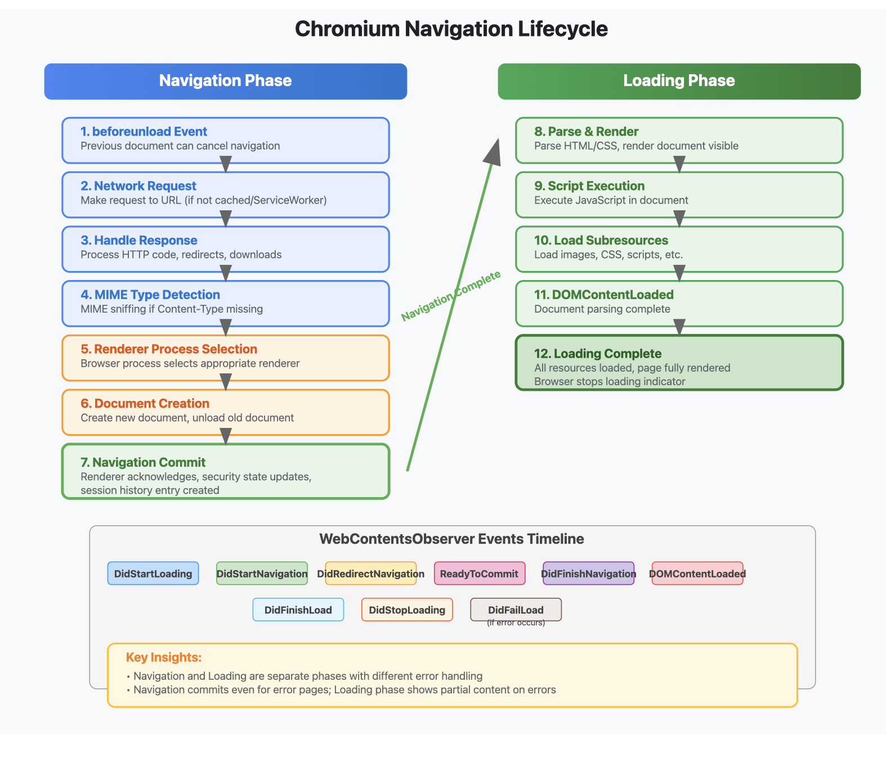

## Bug Overview
When dragging from one document to another via an inline navigation (same-origin navigation within the same tab), an event misrouting occurs due to mismanagement of which RFH is "current" during the navigation transition.

## Step-by-Step Issue Breakdown
Normal Expected Flow
Ideally, when navigating within the same origin, Chromium reuses the same RFH instance for both source and target documents, maintaining continuity for drag/drop events.

If BFCache does not intervene, this works as expected.

## The Problem with Current Implementation
When there’s an inline navigation (e.g., drag causing navigation from drag_source.html → drop_target.html), Chromium creates a new RFH for the navigation target, but does not commit to it immediately.

While navigation is speculative (not yet committed), both the speculative RFH (drop target) and current RFH (drag source) exist in memory.

Any drag events (particularly onDragOver) that should target the new document (drop target) are mistakenly sent to the old/current RFH (drag source).

This misrouting persists until the navigation is fully committed and the new RFH becomes "current." However, actual user drag operations can block this commit from happening at the expected time, preventing the “Ready” message from being delivered.

## Effects with BFCache

BFCache complicates this further by preserving prior RFHs in memory and reusing them for back/forward navigations, resulting in inconsistent RFH handoffs.

## Root Cause
The root cause is a timing and state management issue in the browser process:

During inline navigation triggered by a drag event, the browser creates a speculative (future) RFH for the navigation target.

The drag event routing logic, however, does not wait for the navigation commit. Instead, it keeps routing events (like onDragOver) to the RFH considered “current” at the time—the drag source—not the intended navigation target.

The drag gesture itself blocks the “Ready” signal, preventing the speculative RFH (drop target) from becoming “current,” so events are not delivered to the page under the mouse pointer.

## Consequence
Drag-and-drop operations fail or behave unexpectedly when dragging between same-origin pages via inline navigation, because drag events are sent to the wrong document context.

This makes implementing seamless drag-and-drop UIs across navigations unreliable in Chromium.

## Navigation lifecycle

