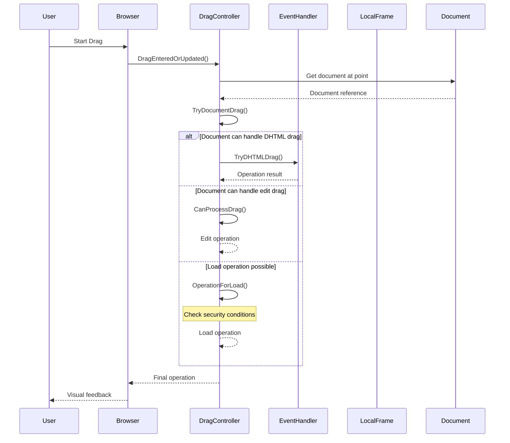
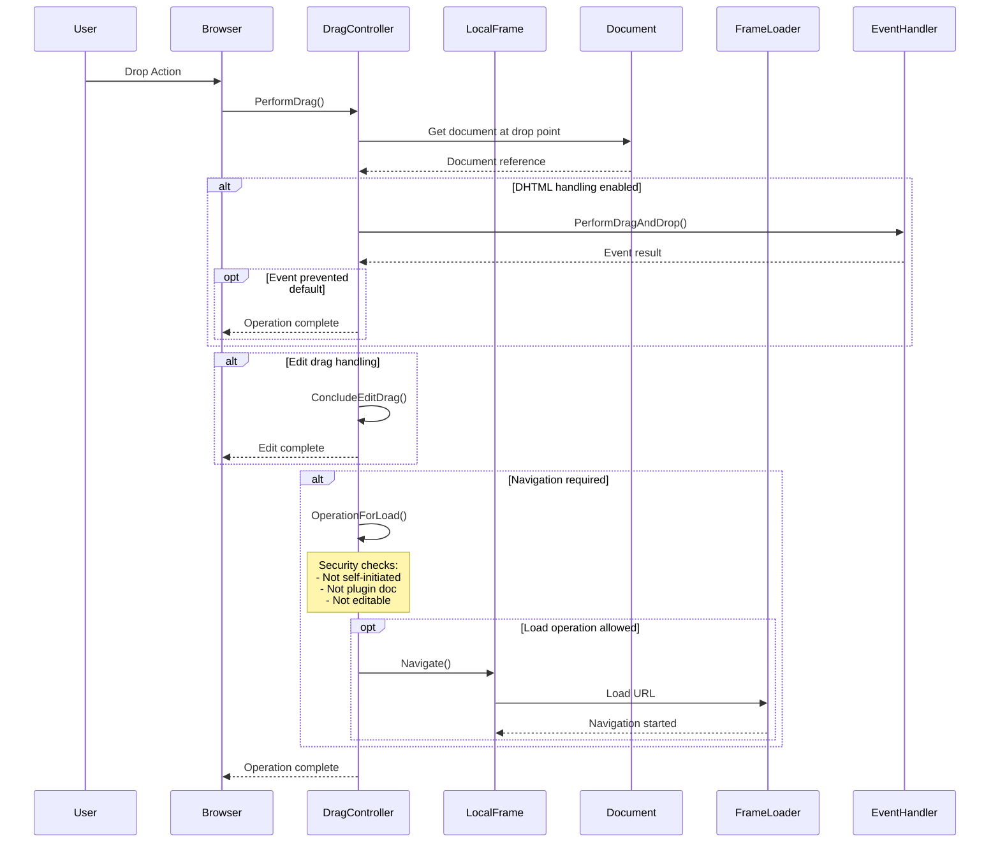
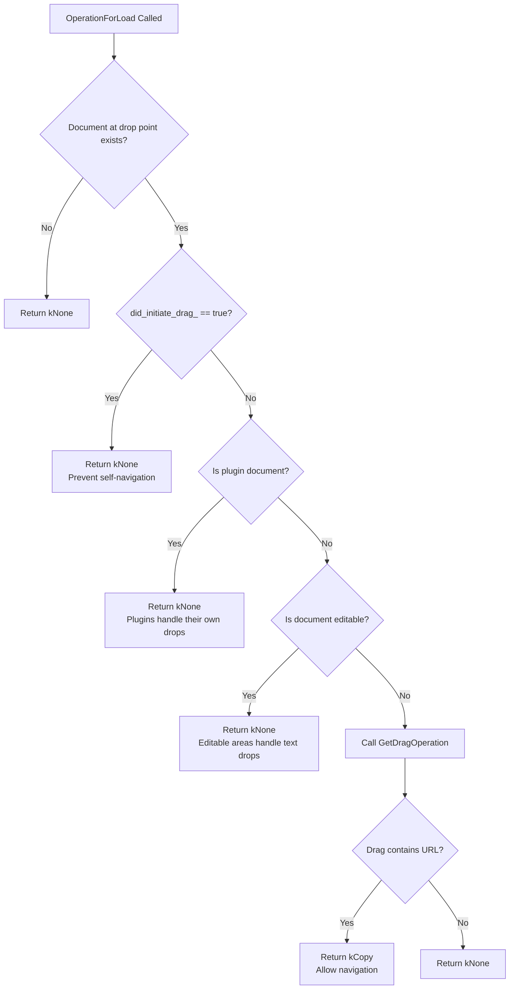
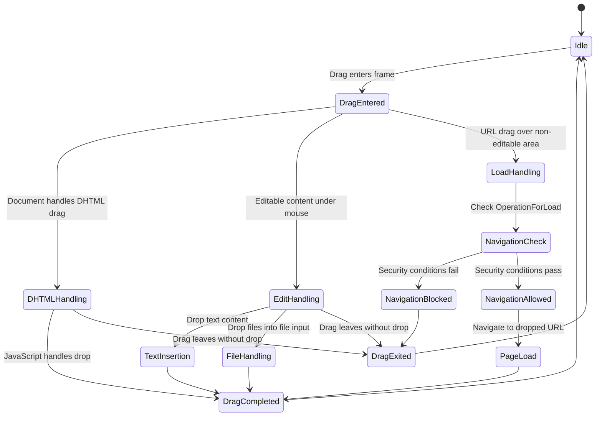

# Chromium Drag & Drop Analysis: Focus on Navigation Issues

This document provides a comprehensive analysis of Chromium's drag and drop functionality, with particular attention to the role of `DragController::OperationForLoad` and navigation-related bugs.

## Overview

The Chromium drag and drop system is primarily managed by the `DragController` class located in `third_party/blink/renderer/core/page/drag_controller.cc`. The system handles multiple types of drag operations and coordinates between different components to ensure secure and functional drag-drop behavior.

## Key Components

### 1. DragController Class
- **Location**: `third_party/blink/renderer/core/page/drag_controller.cc`
- **Purpose**: Central coordinator for all drag and drop operations
- **Key State Variables**:
  - `did_initiate_drag_`: Tracks whether this frame initiated the drag
  - `document_under_mouse_`: Current document receiving drag events
  - `drag_initiator_`: The DOM window that started the drag
  - `drag_destination_action_`: What types of drops are allowed

### 2. DragData Class
- **Location**: `third_party/blink/renderer/core/page/drag_data.h`
- **Purpose**: Encapsulates all data associated with a drag operation
- **Key Methods**:
  - `ContainsURL()`: Check if drag contains URL data
  - `ContainsFiles()`: Check if drag contains file data
  - `AsURL()`: Extract URL from drag data
  - `AsPlainText()`: Extract plain text from drag data

### 3. Key Methods Analysis

#### `DragController::OperationForLoad`
```cpp
DragOperation DragController::OperationForLoad(DragData* drag_data, LocalFrame& local_root)
```

**Purpose**: Determines if a drag operation should result in a navigation (page load)

**Logic Flow**:
1. **Document Analysis**: Gets the document at the drop point
2. **Blocking Conditions**: Returns `kNone` if:
   - `did_initiate_drag_` is true (prevents self-navigation)
   - Document is a plugin document
   - Document is editable
3. **Operation Determination**: Calls `GetDragOperation()` to determine the actual operation

**Critical Security Feature**: The `did_initiate_drag_` check prevents a page from navigating itself through drag operations, which could be used maliciously.

## Drag & Drop Flow Analysis

### High-Level Sequence Diagram



### Detailed Drop Operation Flow



### Security Decision Tree for OperationForLoad



## State Diagram for Drag Operations



## Key Issues and Bug Analysis

### Problem: Navigation Across Origins

The current implementation of `OperationForLoad` has security measures that can interfere with legitimate cross-origin navigation scenarios.

**Current Logic Issues**:
1. **Self-Navigation Prevention**: `did_initiate_drag_` blocks all self-initiated navigations, even legitimate ones
2. **Document State Checks**: Plugin and editable document checks may be too restrictive
3. **Cross-Origin Coordination**: Different frames may have inconsistent drag state

### Critical Code Paths

#### 1. Drag Entry and Update Path
```
DragEnteredOrUpdated()
├── MouseMovedIntoDocument()
├── TryDocumentDrag()
│   ├── Security origin checks
│   ├── TryDHTMLDrag()
│   └── Edit drag processing
└── OperationForLoad() [if no document handling]
```

#### 2. Drop Execution Path
```
PerformDrag()
├── DHTML drop handling
├── ConcludeEditDrag()
└── Navigation execution
    ├── OperationForLoad() check
    ├── URL extraction
    └── LocalFrame::Navigate()
```

## Logging and Debugging

### Real-World Log Analysis (Runtime Evidence)

Using Chrome debug logging (`--enable-logging=stderr --v=0`), I captured the actual navigation bug in WPT test scenario:

#### Bug Evidence: State Inconsistency
```log
// Phase 1: Source Document (001.xhtml) - BLOCKED
StartDrag() → did_initiate_drag_ = 1
OperationForLoad() → "returning kNone due to blocking conditions: self_initiated=1"
Final result: operation=0, document_is_handling_drag=0

// Phase 2: Navigation Transition
MouseMovedIntoDocument() → 001.xhtml → 001-1.xhtml
Critical: did_initiate_drag_ becomes 0

// Phase 3: Target Document (001-1.xhtml) - ALLOWED
TryDHTMLDrag() → "UpdateDragAndDrop result: 2"
Final result: operation=1, document_is_handling_drag=1
```

#### Key Discovery
**Same user drag action has different outcomes based on evaluation timing**:
- Source document blocks due to `did_initiate_drag_=1`
- Target document allows because flag resets to `0`
- **Root cause**: Security flag inconsistency across document boundaries

### Debug Commands for Investigation

```bash
# Enable comprehensive logging
./chrome --enable-logging=stderr --v=0 > chrome_log.txt 2>&1

# Filter drag-specific logs
grep "DragController" chrome_log.txt | grep "did_initiate_drag"

# Track OperationForLoad decisions
grep "OperationForLoad.*returning\|Final operation" chrome_log.txt

# Monitor document transitions
grep "MouseMovedIntoDocument" chrome_log.txt
```

### Logging Infrastructure

The current code includes extensive logging (LOG(INFO)) for debugging drag operations. Key log points include:

1. **Entry/Exit Points**: All major methods log entry and exit
2. **Security Decisions**: Origin checks and blocking conditions
3. **Operation Results**: What type of drag operation was determined
4. **State Changes**: Changes to `did_initiate_drag_` and document tracking
5. **Cross-Document Transitions**: Document changes during drag operations

## Recommendations for Navigation Bug Fixes

### 1. Enhanced Cross-Origin Handling
- Review self-navigation prevention logic
- Consider frame relationship context
- Implement more granular security policies

### 2. State Management Improvements
- Better coordination between frames during navigation
- Clear separation of drag state vs navigation state
- Consistent handling of iframe scenarios

### 3. Testing Considerations
- Cross-origin drag-drop scenarios
- Navigation during active drag operations
- Plugin document interactions
- File system vs URL drags

## Related Files for Investigation

1. **Core Drag Logic**:
   - `third_party/blink/renderer/core/page/drag_controller.cc`
   - `third_party/blink/renderer/core/page/drag_controller.h`
   - `third_party/blink/renderer/core/page/drag_data.h`

2. **Event Handling**:
   - `third_party/blink/renderer/core/input/event_handler.cc`
   - `third_party/blink/renderer/core/frame/web_frame_widget_impl.cc`

3. **Navigation**:
   - `third_party/blink/renderer/core/loader/frame_loader.cc`
   - `third_party/blink/renderer/core/frame/local_frame.cc`

4. **Testing**:
   - `third_party/blink/renderer/core/page/drag_controller_test.cc`

This analysis provides the foundation for understanding and debugging navigation-related drag-drop issues in Chromium.
