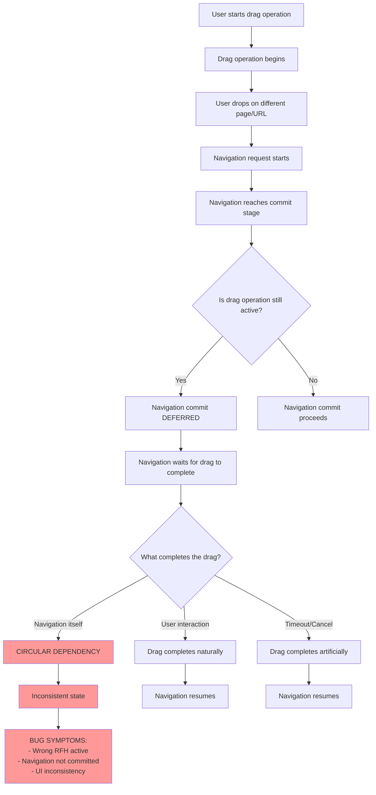
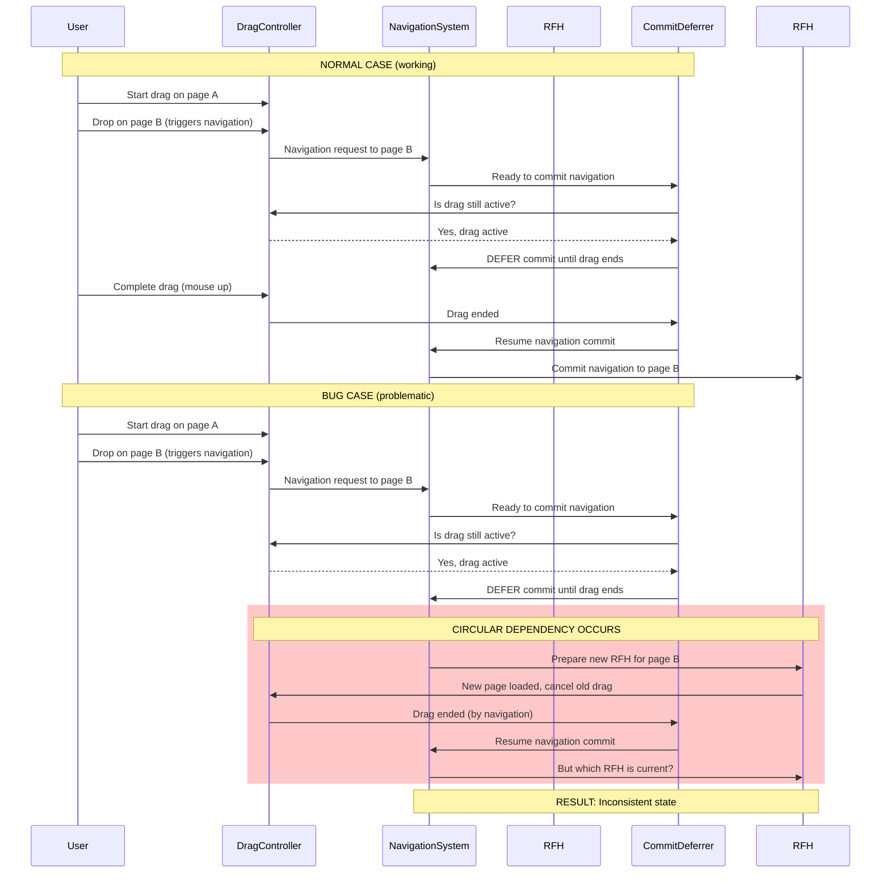
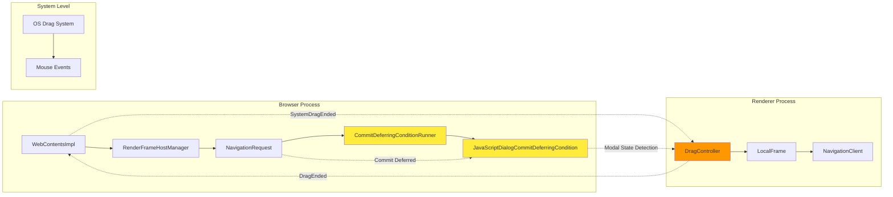
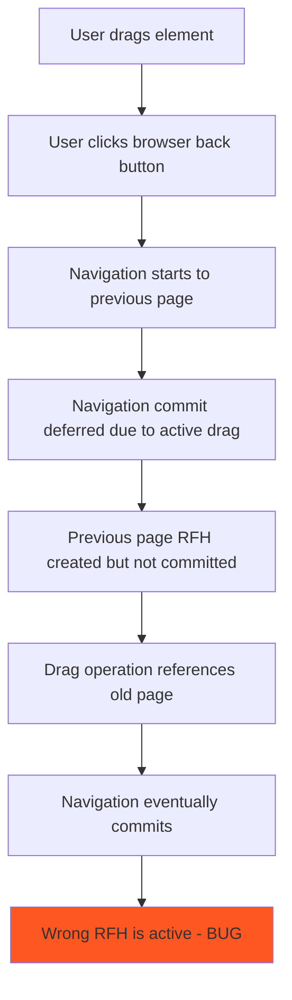
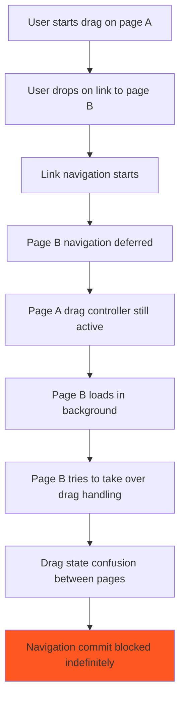
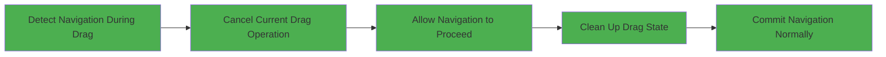
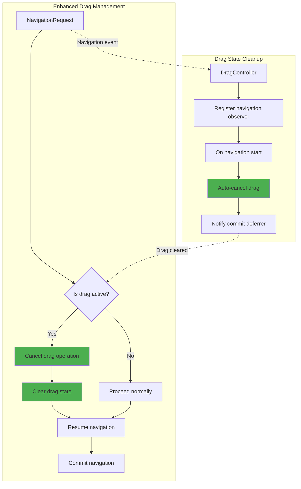

# Drag and Drop Bug Root Cause Analysis

## Overview

This document provides a detailed analysis of the root cause behind the drag and drop navigation bug in Chromium, where drag operations interfere with navigation timing and cause unexpected behavior.

## Root Cause Summary

The bug occurs because **navigation commits are deferred until drag operations complete**, but the drag operation can be **interrupted by the navigation itself**, creating a circular dependency that leads to inconsistent behavior.

## Detailed Root Cause Analysis

### The Core Problem

### The Problematic Sequence

The bug manifests in this specific sequence:

### Key Components Involved

## The Specific Bug Scenarios

### Scenario 1: Back/Forward Navigation During Drag

### Scenario 2: Link Navigation During Drag

## Root Cause Components

### 1. CommitDeferringConditionRunner
- **Purpose**: Prevents navigation commits during unstable states
- **Problem**: Treats drag operations as "modal-like" states that block commits
- **Location**: `content/browser/renderer_host/commit_deferring_condition_runner.cc`

### 2. JavaScriptDialogCommitDeferringCondition
- **Purpose**: Detects modal states (dialogs, drag operations)
- **Problem**: Incorrectly identifies drag states as requiring commit deferral
- **Location**: `content/browser/web_contents/java_script_dialog_commit_deferring_condition.cc`

### 3. DragController State Management
- **Purpose**: Manages drag operation lifecycle
- **Problem**: State persists across navigation boundaries
- **Location**: `third_party/blink/renderer/core/page/drag_controller.cc`

## The Fix Requirements

To fix this bug, the system needs to:

### Proposed Solution Architecture

## Testing Strategy

The fix should be validated with these test cases:

1. **Drag + Back Navigation**: Drag element, hit back button, verify navigation completes
2. **Drag + Link Click**: Drag element, click link, verify new page loads correctly
3. **Drag + Address Bar**: Drag element, type new URL, verify navigation works
4. **Cross-Origin Drag**: Drag between different origin pages during navigation
5. **Multiple Frame Drag**: Drag in iframe while parent navigates

## Related Code Locations

- **Navigation Commit Logic**: `content/browser/renderer_host/navigation_request.cc:6144`
- **Commit Deferring**: `content/browser/renderer_host/commit_deferring_condition_runner.cc:197`
- **Drag State Management**: `third_party/blink/renderer/core/page/drag_controller.cc:222`
- **Modal State Detection**: `content/browser/web_contents/java_script_dialog_commit_deferring_condition.cc:70`

## Conclusion

The drag and drop navigation bug is caused by a circular dependency where:
1. Navigation commits are deferred while drag operations are active
2. Drag operations can be interrupted by navigation state changes
3. This creates an inconsistent state where neither the drag nor the navigation can complete properly

The fix requires breaking this circular dependency by ensuring drag operations are cleanly cancelled when navigation begins, allowing the navigation to proceed normally.
