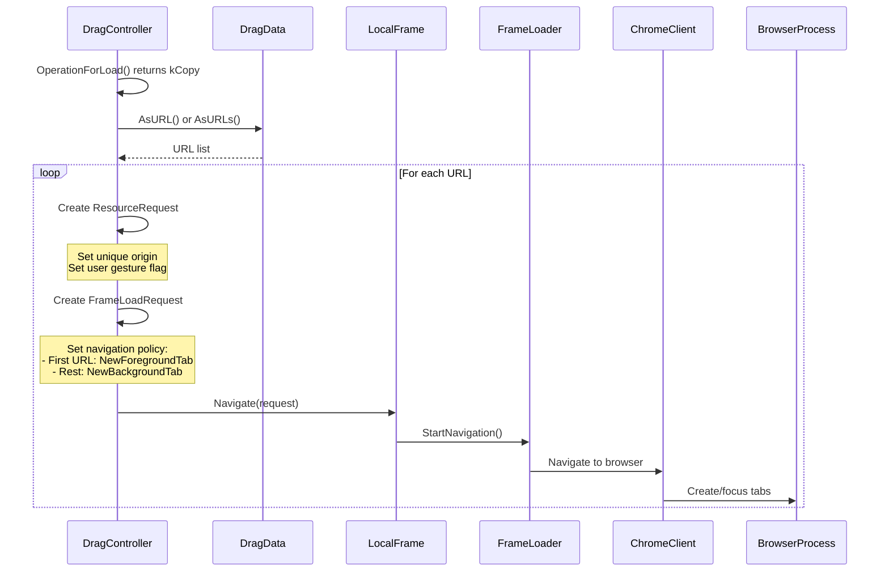
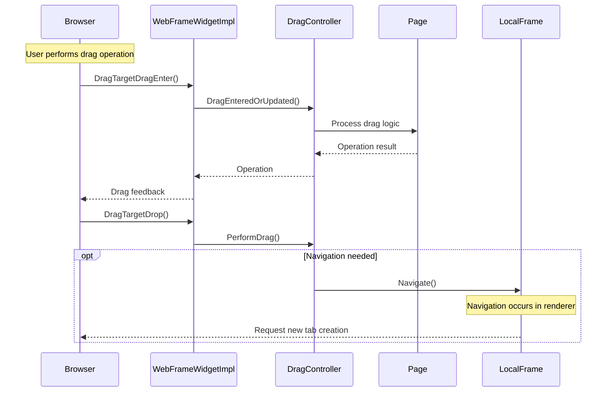
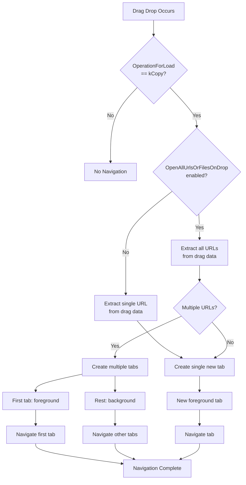
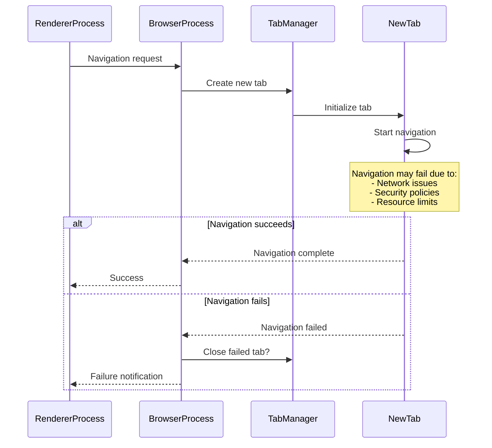

# Navigation Integration in Drag & Drop System

## Overview
This document analyzes how drag-drop operations integrate with Chromium's navigation system, focusing on the handoff between drag controllers and frame loaders.

## Navigation Execution Flow

When `OperationForLoad` determines that navigation should proceed, the following sequence occurs in `PerformDrag`:



## Critical Navigation Configuration

### Security Origin Handling
```cpp
// From PerformDrag method
ResourceRequest resource_request(url);
resource_request.SetHasUserGesture(has_transient_user_activation);

// Use a unique origin to match other navigations that are initiated
// outside of a renderer process (e.g. omnibox navigations).
resource_request.SetRequestorOrigin(SecurityOrigin::CreateUniqueOpaque());
```

**Why Unique Origin?**
- Treats drag-drop navigation like external navigation (omnibox, bookmarks)
- Prevents potential security issues with same-origin requests
- Matches expected browser behavior for "external" navigation sources

### Tab Creation Policy
```cpp
// Open the dropped URL in a new tab to avoid potential data-loss
request.SetNavigationPolicy(
    should_focus_tab
        ? NavigationPolicy::kNavigationPolicyNewForegroundTab
        : NavigationPolicy::kNavigationPolicyNewBackgroundTab);
```

**Multi-URL Handling**:
- First URL opens in focused new tab
- Subsequent URLs open as background tabs
- Prevents data loss in current tab

## Integration Points with Browser Process

### WebFrameWidgetImpl Integration

The browser process communicates drag events to the renderer through `WebFrameWidgetImpl`:



## Key Files in Navigation Flow

### 1. Renderer-Side Navigation Initiation
- **`drag_controller.cc`**: Makes navigation decision
- **`local_frame.cc`**: Executes navigation request
- **`frame_loader.cc`**: Handles actual loading logic
- **`web_frame_widget_impl.cc`**: Browser-renderer communication

### 2. Browser-Side Tab Management
- **`web_contents_view_*.cc`**: Platform-specific drop handling
- **`browser_navigator.cc`**: Tab creation and focusing
- **`chrome_client.cc`**: Renderer-browser navigation bridge

## Navigation Policy Decision Tree



## Debugging Navigation Issues

### Key Log Points for Navigation Debugging

1. **Decision Point Logging**:
   ```cpp
   LOG(INFO) << "OperationForLoad result: " << static_cast<int>(operation);
   ```

2. **URL Extraction Logging**:
   ```cpp
   LOG(INFO) << "Extracted URLs count: " << urls.size();
   for (const String& url : urls) {
     LOG(INFO) << "URL: " << url.Utf8().c_str();
   }
   ```

3. **Navigation Request Logging**:
   ```cpp
   LOG(INFO) << "Creating navigation request for: " << url.Utf8().c_str()
             << ", policy: " << static_cast<int>(request.GetNavigationPolicy());
   ```

### Common Navigation Failure Modes

1. **Security Blocking**: Origin policy prevents navigation
2. **URL Extraction Failure**: DragData doesn't contain valid URLs
3. **Tab Creation Failure**: Browser process rejects tab creation
4. **Policy Conflicts**: Navigation policy conflicts with browser settings

## Cross-Process Communication Challenges

### Renderer-Browser Coordination



### State Synchronization Issues

**Problem**: Drag state in renderer may not reflect browser-side navigation state

**Symptoms**:
- User sees drag feedback but navigation doesn't occur
- Multiple tabs created unexpectedly
- Wrong tab gets focus

**Solution Areas**:
1. Better error propagation from browser to renderer
2. Atomic navigation operations
3. Rollback mechanisms for partial failures

## Testing Recommendations

### Navigation-Specific Test Cases

1. **Single URL Drop**
   - Verify single new tab creation
   - Verify correct tab focusing
   - Verify proper URL loading

2. **Multiple URL Drop** (when feature enabled)
   - Verify multiple tab creation
   - Verify first tab focus, others background
   - Verify all URLs load correctly

3. **Navigation Failure Scenarios**
   - Invalid URLs in drag data
   - Network failures during navigation
   - Policy-blocked navigations

4. **Cross-Origin Navigation**
   - Drag from one origin to another
   - Verify security origin handling
   - Verify proper tab isolation

### Automated Testing Approach

```cpp
// Example test structure
TEST_F(DragNavigationTest, SingleURLDrop) {
  // Setup: Create page with draggable URL
  // Action: Perform drag-drop to navigation target
  // Verify: New tab created with correct URL
  // Verify: Original tab unchanged
  // Verify: Focus moved to new tab
}

TEST_F(DragNavigationTest, CrossOriginURLDrop) {
  // Setup: Cross-origin drag scenario
  // Action: Drop URL from origin A to origin B
  // Verify: Navigation allowed
  // Verify: Proper security context in new tab
}
```

This analysis provides the complete picture of how drag-drop navigation integrates with Chromium's broader navigation system, highlighting key integration points and potential failure modes.
