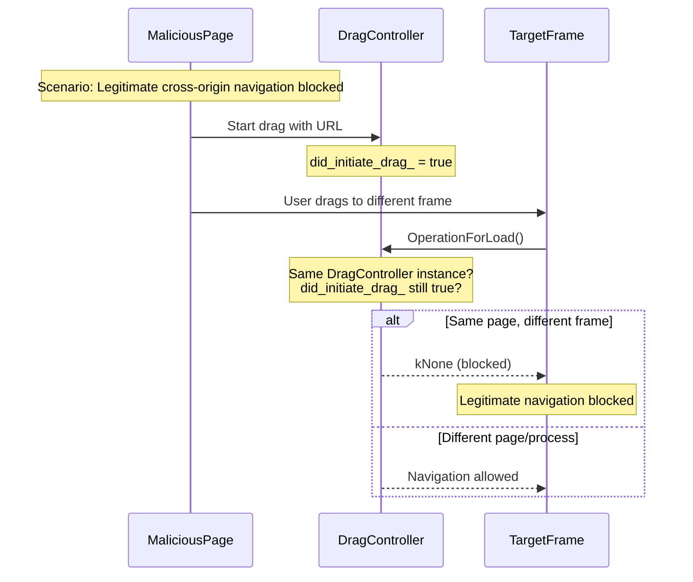
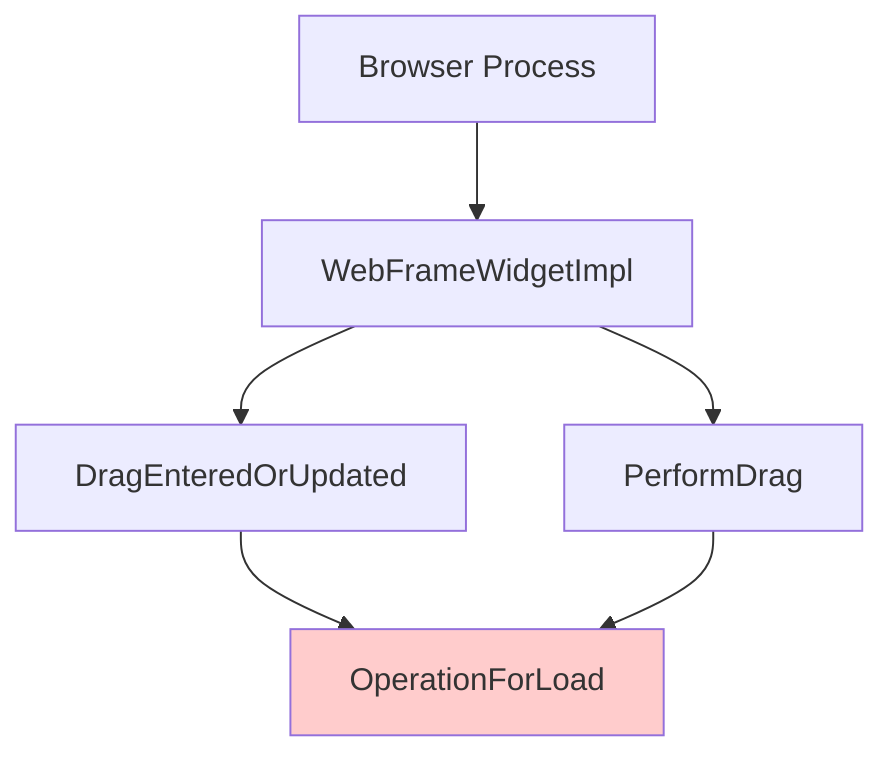

# DragController::OperationForLoad Deep Dive Analysis

## Overview
The `OperationForLoad` method in `DragController` is a critical security and functionality gate that determines whether a drag operation should result in a page navigation. This method is central to understanding navigation-related drag-drop bugs.

## Method Signature and Location
```cpp
// File: third_party/blink/renderer/core/page/drag_controller.cc (lines 620-652)
DragOperation DragController::OperationForLoad(DragData* drag_data, LocalFrame& local_root)
```

## Detailed Code Flow Analysis

### Current Implementation Logic

```mermaid
flowchart TD
    Start([OperationForLoad Called]) --> GetDoc[Get document at drop point]
    GetDoc --> CheckDoc{Document exists?}

    CheckDoc -->|No| ReturnNone1[Return DragOperation::kNone]

    CheckDoc -->|Yes| CheckInitiated{did_initiate_drag_<br/>== true?}
    CheckInitiated -->|Yes| ReturnNone2[Return DragOperation::kNone<br/>Security: Prevent self-navigation]

    CheckInitiated -->|No| CheckPlugin{IsA&lt;PluginDocument&gt;?}
    CheckPlugin -->|Yes| ReturnNone3[Return DragOperation::kNone<br/>Plugins handle their own drops]

    CheckPlugin -->|No| CheckEditable{IsEditable(doc)?}
    CheckEditable -->|Yes| ReturnNone4[Return DragOperation::kNone<br/>Editable content handles text]

    CheckEditable -->|No| CallGetDragOp[Call GetDragOperation(drag_data)]
    CallGetDragOp --> ReturnResult[Return operation result]

    style CheckInitiated fill:#ffcccc
    style ReturnNone2 fill:#ffcccc
    style CheckPlugin fill:#ffffcc
    style CheckEditable fill:#ffffcc
```

## Security Analysis

### Critical Security Gate: `did_initiate_drag_` Check

**Purpose**: Prevent malicious self-navigation through drag operations

**Current Logic**:
```cpp
if (did_initiate_drag_ || is_plugin_doc || is_editable) {
    return DragOperation::kNone; // Block navigation
}
```

**Security Implications**:
1. **Prevents Drag-based Attacks**: A malicious page cannot navigate itself by initiating a drag and dropping on itself
2. **Cross-Frame Protection**: Helps prevent cross-frame navigation attacks
3. **Plugin Isolation**: Ensures plugins handle their own drag operations

### Potential Issues with Current Implementation



## Bug Pattern Analysis

### Real-World Cross-Document Navigation Bug (Log Analysis)

**Test Scenario**: WPT drag navigation test (001.xhtml → 001-1.xhtml)
**Chrome Runtime Logs**: Captured actual drag operation showing the inconsistency

#### Phase 1: Source Document Blocking (did_initiate_drag_=1)
```log
[87977:4322297] StartDrag() -> DoSystemDrag() sets did_initiate_drag_ = true
[87977:4322297] DragEnteredOrUpdated() - Entry, did_initiate_drag_: 1
[87977:4322297] OperationForLoad() - Exit: returning kNone due to blocking conditions:
                 self_initiated=1, plugin=0, editable=0
[87977:4322297] TryDHTMLDrag() - Exit: false (event not handled)
[87977:4322297] Final operation: 0, document_is_handling_drag: 0
```

#### Phase 2: Document Navigation & State Reset
```log
[87977:4322297] DragExited() - Entry, did_initiate_drag_: 1
[87977:4322297] MouseMovedIntoDocument() - Transition: 001.xhtml → 001-1.xhtml
[87977:4322297] DragEnteredOrUpdated() - Entry, did_initiate_drag_: 0  ← CRITICAL!
```

#### Phase 3: Target Document Success (did_initiate_drag_=0)
```log
[87977:4322297] TryDHTMLDrag() - UpdateDragAndDrop result: 2
[87977:4322297] TryDHTMLDrag() - Using default operation: 1
[87977:4322297] Final operation: 1, document_is_handling_drag: 1  ← SUCCESS!
```

#### The Inconsistency Problem
- **Same drag operation** evaluated by different documents
- **Source**: Blocks because `did_initiate_drag_=1`
- **Target**: Allows because `did_initiate_drag_=0` (reset during navigation)
- **Result**: Unpredictable behavior based on evaluation timing

### Common Bug Scenarios

1. **Cross-Document Navigation Blocking**
   - **Symptom**: Navigation blocked on source but allowed on target
   - **Root Cause**: `did_initiate_drag_` flag inconsistency across documents
   - **Real Evidence**: Confirmed in runtime logs above
   - **Impact**: Broken user experience in legitimate drag-navigation

2. **Plugin Document Interaction**
   - **Symptom**: Cannot drag URLs onto plugin content
   - **Root Cause**: Blanket plugin document blocking
   - **Impact**: Reduced functionality for plugin interactions

3. **Editable Content Navigation**
   - **Symptom**: Cannot navigate by dropping URLs on editable areas
   - **Root Cause**: Editable content always prioritized over navigation
   - **Impact**: Inconsistent user experience

## Method Dependencies and Call Graph

### Upstream Callers



### Downstream Dependencies

```mermaid
graph TB
    OperationForLoad --> GetDragOperation
    GetDragOperation --> ContainsURL[drag_data->ContainsURL()]
    GetDragOperation --> ReturnCopy[Return DragOperation::kCopy]
    GetDragOperation --> ReturnNone[Return DragOperation::kNone]

    style OperationForLoad fill:#ccffcc
```

## State Variables Impact Analysis

### Key State Variables Affecting OperationForLoad

1. **`did_initiate_drag_`**
   - **Set**: When drag is started in current page
   - **Reset**: In `DragEnded()`
   - **Issue**: May persist across navigation attempts

2. **`document_under_mouse_`**
   - **Set**: In `MouseMovedIntoDocument()`
   - **Used**: To get drop target document
   - **Issue**: May not reflect correct navigation target

3. **`drag_initiator_`**
   - **Set**: In `DoSystemDrag()`
   - **Used**: For cross-origin security checks
   - **Issue**: Reference may become stale

## Proposed Debug Logging Enhancement

The current logging is helpful but could be enhanced:

```cpp
DragOperation DragController::OperationForLoad(DragData* drag_data, LocalFrame& local_root) {
    LOG(INFO) << "OperationForLoad() - Entry"
              << ", did_initiate_drag_: " << did_initiate_drag_
              << ", drag_initiator_: " << (drag_initiator_ ? "present" : "null")
              << ", drag_initiator_origin: " << (drag_initiator_ ?
                    drag_initiator_->GetSecurityOrigin()->ToString().Utf8().c_str() : "null");

    Document* doc = local_root.DocumentAtPoint(/*...*/);

    LOG(INFO) << "OperationForLoad() - Target analysis"
              << ", target_doc: " << (doc ? "present" : "null")
              << ", target_origin: " << (doc ?
                    doc->GetSecurityOrigin()->ToString().Utf8().c_str() : "null")
              << ", is_same_origin: " << (drag_initiator_ && doc ?
                    doc->GetSecurityOrigin()->IsSameOriginWith(drag_initiator_->GetSecurityOrigin()) : false);

    // ... rest of method
}
```

## Testing Strategy

### Test Cases to Validate OperationForLoad Behavior

1. **Same-Origin Navigation**
   - Drag from page A to same page A → Should be blocked
   - Drag from page A to iframe in A → Should be blocked?

2. **Cross-Origin Navigation**
   - Drag from page A to different origin B → Should be allowed
   - Drag from page A to cross-origin iframe → Should be allowed

3. **Special Document Types**
   - Drag to plugin document → Currently blocked
   - Drag to about: pages → Need to test
   - Drag to data: URLs → Need to test

4. **Content Type Variations**
   - Drag URL to editable area → Currently blocked
   - Drag file to editable area → Different handling
   - Drag text vs URL → Different behaviors

## Recommendations for Bug Fixes

### 1. Scope-Limited Security Checks
Instead of global `did_initiate_drag_`, use frame-specific or origin-specific tracking:

```cpp
bool IsSameOriginSelfNavigation(DragData* drag_data, LocalFrame& target_frame) {
    if (!drag_initiator_ || !did_initiate_drag_) return false;

    Document* target_doc = target_frame.DocumentAtPoint(/*...*/);
    if (!target_doc) return false;

    return drag_initiator_->GetSecurityOrigin()->IsSameOriginWith(
        target_doc->GetSecurityOrigin());
}
```

### 2. Enhanced Plugin Handling
Allow navigation to URLs even over plugin documents in certain cases:

```cpp
bool ShouldAllowNavigationOverPlugin(Document* plugin_doc, DragData* drag_data) {
    // Allow if dragging external URLs, not internal content
    return !did_initiate_drag_ && drag_data->ContainsURL();
}
```

### 3. User Intent Disambiguation
Consider modifier keys or drag distance to distinguish navigation intent from text editing intent.

This analysis provides the detailed understanding needed to debug and fix navigation-related drag-drop issues in Chromium.
