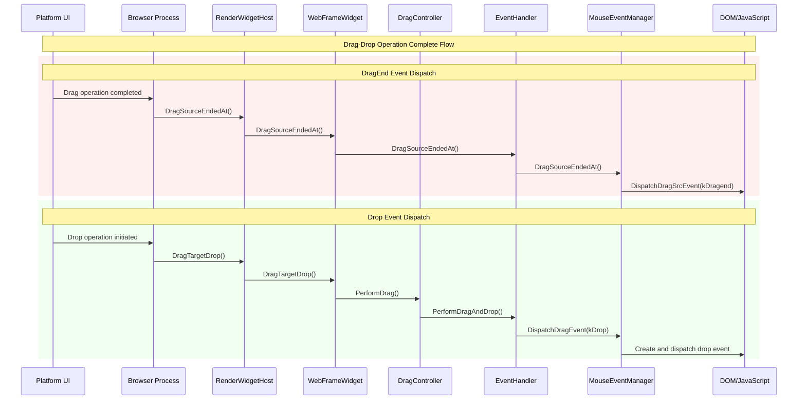
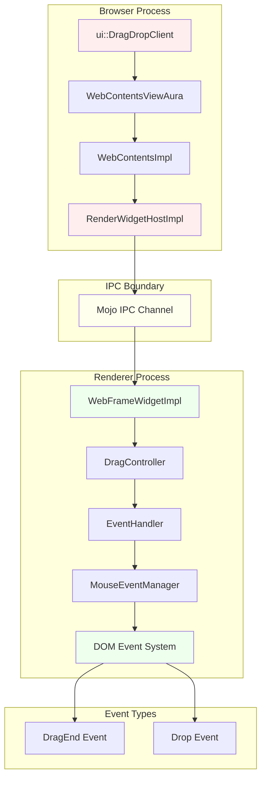

# Chromium Drag-Drop Event Dispatch Analysis

## Overview
This document provides a comprehensive analysis of both DragEnd and Drop event dispatch mechanisms in Chromium's drag-and-drop system. The investigation covers the complete event flow from browser process through renderer to final DOM event dispatch.

## DragEnd Event Dispatch

### Complete Call Stack
The DragEnd event dispatch follows this complete path from browser to DOM:

```
Browser Process → Renderer Process → DOM Event
```

**Complete Flow:**
1. `ui::DragDropClient` (Platform-specific drag client)
2. `WebContentsViewAura::EndDrag` (Browser view layer)
3. `WebContentsImpl::DragSourceEndedAt` (Browser content layer)
4. `RenderWidgetHostImpl::DragSourceEndedAt` (Browser-to-renderer IPC)
5. `WebFrameWidgetImpl::DragSourceEndedAt` (Renderer IPC boundary)
6. `EventHandler::DragSourceEndedAt` (Renderer event coordination)
7. `MouseEventManager::DragSourceEndedAt` (Final event dispatch)
8. `DispatchDragSrcEvent(event_type_names::kDragend, event)` (DOM event creation)

### Key Code Location
**File:** `third_party/blink/renderer/core/input/mouse_event_manager.cc`
**Method:** `MouseEventManager::DragSourceEndedAt`
**Line:** 1071
**Code:** `DispatchDragSrcEvent(event_type_names::kDragend, event)`

```cpp
void MouseEventManager::DragSourceEndedAt(const WebMouseEvent& event,
                                          DragOperation operation) {
  // ... setup code ...

  // Line 1071 - Final DragEnd event dispatch
  DispatchDragSrcEvent(event_type_names::kDragend, event);
}
```

## Drop Event Dispatch

### Browser-to-Renderer Entry Point
**File:** `third_party/blink/renderer/core/frame/web_frame_widget_impl.cc`
**Method:** `WebFrameWidgetImpl::DragTargetDrop`
**Lines:** 630-634

```cpp
void WebFrameWidgetImpl::DragTargetDrop(const WebDragData& web_drag_data,
                                         const gfx::PointF& point_in_viewport,
                                         const gfx::PointF& screen_point,
                                         DragOperationsMask operations_allowed,
                                         uint32_t key_modifiers,
                                         base::OnceClosure callback) {
  // ... validation and setup ...

  DragData drag_data(current_drag_data_.Get(),
                     ViewportToRootFrame(point_in_viewport), screen_point,
                     operations_allowed_, web_drag_data.ForceDefaultAction());

  // Line 633-634 - Initiate drop event sequence
  GetPage()->GetDragController().PerformDrag(&drag_data,
                                             *local_root_->GetFrame());
}
```

### Drag Controller Coordination
**File:** `third_party/blink/renderer/core/page/drag_controller.cc`
**Method:** `DragController::PerformDrag`
**Lines:** 253-273

```cpp
bool DragController::PerformDrag(DragData* drag_data, LocalFrame& local_root) {
  // ... drag operation setup ...

  // Line 273 - Delegate to EventHandler for actual drop processing
  return event_handler.PerformDragAndDrop(CreateMouseEvent(drag_data), data_transfer);
}
```

### Event Handler Drop Processing
**File:** `third_party/blink/renderer/core/input/event_handler.cc`
**Method:** `EventHandler::PerformDragAndDrop`
**Lines:** 1457-1465

```cpp
bool EventHandler::PerformDragAndDrop(const PlatformMouseEvent& event,
                                      DataTransfer* data_transfer) {
  // ... target validation and setup ...

  // Line 1465 - Final drop event dispatch
  return mouse_event_manager_->DispatchDragEvent(
      event_type_names::kDrop, drag_target_.Get(), nullptr, event, data_transfer);
}
```

### Final Drop Event Dispatch
**File:** `third_party/blink/renderer/core/input/mouse_event_manager.cc`
**Method:** `MouseEventManager::DispatchDragEvent`

```cpp
bool MouseEventManager::DispatchDragEvent(const AtomicString& event_type,
                                           Node* drag_target,
                                           Node* related_target,
                                           const PlatformMouseEvent& event,
                                           DataTransfer* data_transfer) {
  // Creates and dispatches drop event to DOM
  return DispatchDragEvent(...);
}
```

## Architectural Flow Diagrams

### Complete Drag-Drop Event Sequence



### Browser-to-Renderer Architecture



### Drop Event Processing Flow

```mermaid
flowchart LR
    subgraph "Entry Point"
        A[WebFrameWidgetImpl::DragTargetDrop]
    end

    subgraph "Validation & Setup"
        B[Create DragData]
        C[Validate Drop Zone]
        D[Check Permissions]
    end

    subgraph "Event Coordination"
        E[DragController::PerformDrag]
        F[EventHandler::PerformDragAndDrop]
    end

    subgraph "Event Dispatch"
        G[MouseEventManager::DispatchDragEvent]
        H[Create Drop Event]
        I[Dispatch to DOM]
    end

    A --> B
    B --> C
    C --> D
    D --> E
    E --> F
    F --> G
    G --> H
    H --> I

    style A fill:#e1f5fe
    style E fill:#f3e5f5
    style G fill:#e8f5e8
    style I fill:#fff3e0
```



## Key Implementation Details

### DragEnd Event Specifics
- **Trigger Condition:** Called when drag operation completes successfully
- **Source Element:** Dispatched to the element where drag originated
- **Event Type:** `event_type_names::kDragend`
- **Browser Integration:** Coordinated through platform-specific drag clients

### Drop Event Specifics
- **Trigger Condition:** Called when drop operation is performed on valid target
- **Target Element:** Dispatched to the element receiving the drop
- **Event Type:** `event_type_names::kDrop`
- **Data Transfer:** Includes dragged data and operation type

### Critical Code Paths

#### WebFrameWidgetImpl DragEnd Processing
```cpp
// File: third_party/blink/renderer/core/frame/web_frame_widget_impl.cc
// Lines: 637-664
void WebFrameWidgetImpl::DragSourceEndedAt(const gfx::PointF& point_in_viewport,
                                           const gfx::PointF& screen_point,
                                           DragOperation operation,
                                           base::OnceClosure callback) {
  // Creates fake mouse event and delegates to EventHandler
  WebMouseEvent fake_mouse_move(/* ... mouse event setup ... */);

  local_root_->GetFrame()->GetEventHandler().DragSourceEndedAt(fake_mouse_move,
                                                               operation);
}
```

#### WebFrameWidgetImpl Drop Processing
```cpp
// File: third_party/blink/renderer/core/frame/web_frame_widget_impl.cc
// Lines: 600-634
void WebFrameWidgetImpl::DragTargetDrop(/* parameters */) {
  // Validation and race condition prevention
  if (drag_operation_.operation == DragOperation::kNone) {
    // IPC RACE CONDITION: do not allow this drop.
    DragTargetDragLeave(point_in_viewport, screen_point);
    return;
  }

  // Create DragData and initiate drop sequence
  DragData drag_data(current_drag_data_.Get(), /* ... */);
  GetPage()->GetDragController().PerformDrag(&drag_data, *local_root_->GetFrame());
}
```

## Race Condition Handling

### IPC Race Condition Prevention
The code includes specific handling for race conditions between browser and renderer processes:

```cpp
// From WebFrameWidgetImpl::DragTargetDrop
if (drag_operation_.operation == DragOperation::kNone) {
  // IPC RACE CONDITION: do not allow this drop.
  // If this webview transitions from "drop accepting" to "not accepting" state,
  // our IPC message reply may be in-flight or delayed by javascript processing.
  DragTargetDragLeave(point_in_viewport, screen_point);
  return;
}
```

This prevents drops from being processed when the renderer has already determined the operation should be `kNone`, but the browser process hasn't received that information yet.

## File Locations Summary

| Component | File Path | Key Methods |
|-----------|-----------|-------------|
| **Browser Entry** | `content/browser/renderer_host/render_widget_host_impl.cc` | `DragSourceEndedAt()`, `DragTargetDrop()` |
| **IPC Boundary** | `third_party/blink/renderer/core/frame/web_frame_widget_impl.cc` | `DragSourceEndedAt()`, `DragTargetDrop()` |
| **Drag Coordination** | `third_party/blink/renderer/core/page/drag_controller.cc` | `PerformDrag()`, `DragEnded()` |
| **Event Processing** | `third_party/blink/renderer/core/input/event_handler.cc` | `DragSourceEndedAt()`, `PerformDragAndDrop()` |
| **Event Dispatch** | `third_party/blink/renderer/core/input/mouse_event_manager.cc` | `DragSourceEndedAt()`, `DispatchDragEvent()` |

## Event Timing and Coordination

### DragEnd vs Drop Event Timing
- **DragEnd:** Dispatched after drop operation completes, regardless of success
- **Drop:** Dispatched during drop operation, only on valid drop targets
- **Coordination:** Both events may fire for successful drop operations
- **Source vs Target:** DragEnd fires on source element, Drop fires on target element

## Implementation Notes

### Memory Management
- Uses `WrapWeakPersistent()` for callback management
- `base::ScopedClosureRunner` ensures cleanup even on early returns
- Proper lifecycle management of `current_drag_data_` during operations

### Platform Integration
- Platform-specific drag clients handle OS-level drag operations
- Cross-platform abstraction through WebDragData and DragOperation enums
- Proper coordinate transformations between viewport and root frame

### Error Handling
- Comprehensive validation of drag state before processing
- IPC race condition detection and mitigation
- Graceful fallback when operations are cancelled or invalid

## Conclusions

The Chromium drag-drop system implements a sophisticated multi-process architecture with clear separation between browser coordination and renderer event dispatch. Both DragEnd and Drop events follow well-defined paths from platform integration through IPC boundaries to final DOM event creation, with comprehensive error handling and race condition prevention.

The key insight is that while both events are part of the same drag-drop operation, they follow different dispatch paths and timing:
- **DragEnd** represents completion of the drag operation from the source perspective
- **Drop** represents the actual target interaction and data transfer

This architectural separation enables proper event sequencing, error handling, and platform integration while maintaining the expected DOM event model for web applications.
