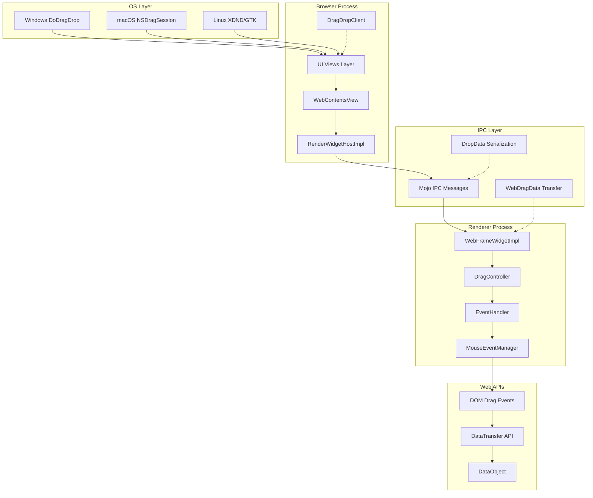
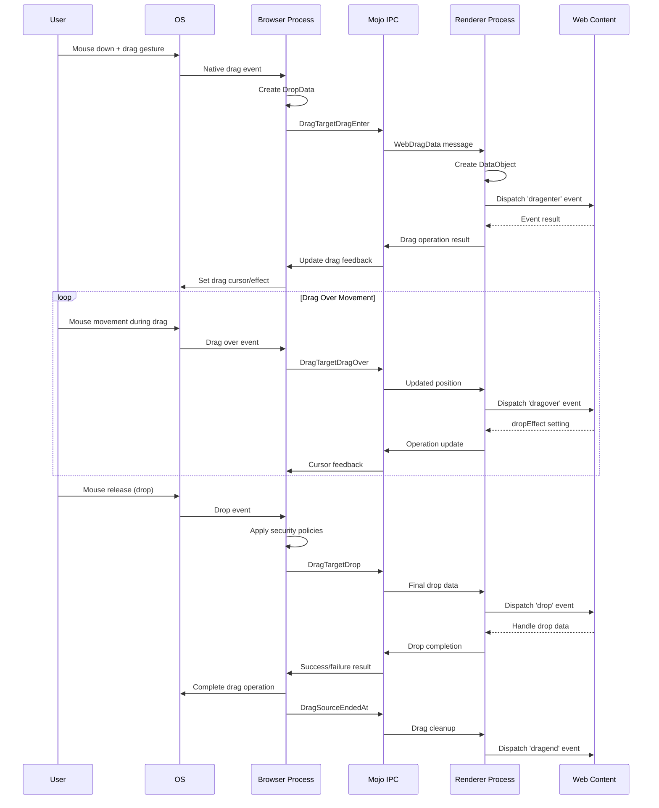
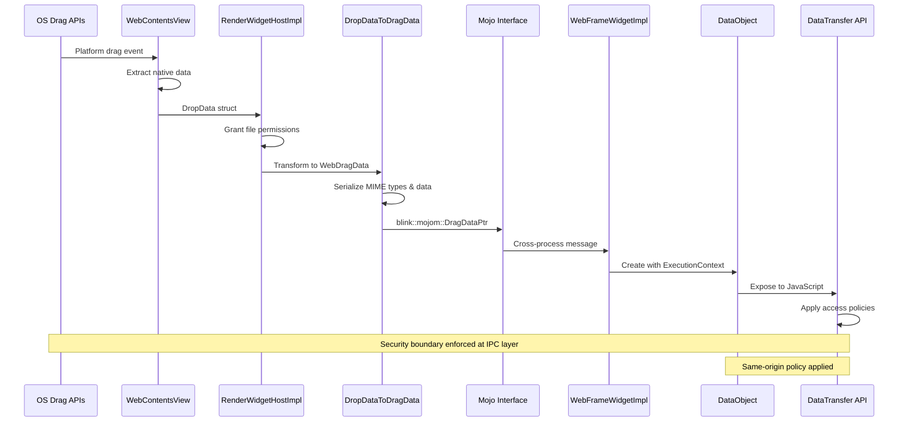
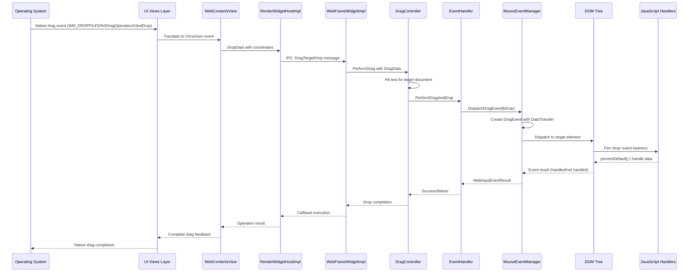

# Comprehensive Chromium Drag and Drop System Analysis

## Executive Summary

Chromium's drag and drop system is a sophisticated multi-process architecture that bridges OS-level drag operations with web platform APIs. The system spans three primary processes: the browser process (handling OS integration and security), renderer processes (managing DOM events and JavaScript APIs), and UI processes (handling visual feedback). This analysis covers the complete lifecycle from user interaction to DOM event dispatch, including cross-process communication via IPC, security boundaries, platform-specific implementations, and performance considerations.

The architecture employs a layered approach where OS-specific drag events are translated through multiple abstraction layers before reaching web content, ensuring security isolation while maintaining compatibility across Windows, macOS, and Linux platforms.

## Architecture Overview

The Chromium drag and drop system operates through a multi-layered architecture spanning multiple processes and abstraction layers:



The system ensures strict security boundaries between processes while maintaining high performance through optimized IPC communication and platform-specific implementations.

## Detailed Component Analysis

### Browser Process Components

#### WebContentsView Layer
**Location**: `content/browser/web_contents/web_contents_view_*.{cc,mm}`

The WebContentsView serves as the primary interface between the browser UI and web content for drag operations. Platform-specific implementations handle OS drag events:

- **Windows**: Direct integration with `IDropTarget` interface
- **macOS**: `WebContentsViewMac` implements `NSDraggingDestination` protocol
- **Linux**: Aura/X11 event handling through GTK/XDND protocols

Key responsibilities:
- OS event translation to Chromium abstractions
- Coordinate system conversion (screen → viewport → document)
- Security policy enforcement for cross-origin drags
- File access permission grants

#### RenderWidgetHostImpl
**Location**: `content/browser/renderer_host/render_widget_host_impl.cc`

Central coordination point for drag operations between browser and renderer processes:

```cpp
void RenderWidgetHostImpl::DragTargetDrop(const DropData& drop_data,
                                          const gfx::PointF& client_point,
                                          const gfx::PointF& screen_point,
                                          int key_modifiers,
                                          base::OnceClosure callback) {
  if (blink_frame_widget_) {
    DropData drop_data_with_permissions(drop_data);
    GrantFileAccessFromDropData(&drop_data_with_permissions);
    StoragePartitionImpl* storage_partition =
        static_cast<StoragePartitionImpl*>(GetProcess()->GetStoragePartition());
    blink_frame_widget_->DragTargetDrop(
        DropDataToDragData(drop_data_with_permissions,
                           storage_partition->GetFileSystemAccessManager(),
                           GetProcess()->GetDeprecatedID(),
                           ChromeBlobStorageContext::GetFor(
                               GetProcess()->GetBrowserContext())),
        ConvertWindowPointToViewport(client_point), screen_point, key_modifiers,
        std::move(callback));
  }
}
```

**Critical Functions**:
- `DragTargetDrop()`: Final drop processing with permission grants
- `DragTargetDragOver()`: Continuous drag feedback
- `DragSourceEndedAt()`: Drag source cleanup
- `GrantFileAccessFromDropData()`: Security policy application

#### Data Transformation Layer
**Location**: `content/browser/renderer_host/data_transfer_util.cc`

Handles conversion between browser process `DropData` and renderer process `WebDragData`:

```cpp
blink::mojom::DragDataPtr DropDataToDragData(
    const DropData& drop_data,
    FileSystemAccessManagerImpl* file_system_access_manager,
    int child_id,
    scoped_refptr<ChromeBlobStorageContext> chrome_blob_storage_context) {
  std::vector<blink::mojom::DragItemPtr> items;
  if (drop_data.text) {
    blink::mojom::DragItemStringPtr item = blink::mojom::DragItemString::New();
    item->string_type = ui::kMimeTypePlainText;
    item->string_data = *drop_data.text;
    items.push_back(blink::mojom::DragItem::NewString(std::move(item)));
  }
  // ... Additional MIME type handling
}
```

### Renderer Process Components

#### WebFrameWidgetImpl
**Location**: `third_party/blink/renderer/core/frame/web_frame_widget_impl.cc`

Entry point for drag operations in the renderer process, receiving IPC messages from browser:

```cpp
void WebFrameWidgetImpl::DragTargetDrop(const WebDragData& web_drag_data,
                                        const gfx::PointF& point_in_viewport,
                                        const gfx::PointF& screen_point,
                                        uint32_t key_modifiers,
                                        base::OnceClosure callback) {
  current_drag_data_ = DataObject::Create(
      target ? target->GetExecutionContext() : nullptr, web_drag_data);

  if (drag_operation_.operation == DragOperation::kNone) {
    // IPC RACE CONDITION: do not allow this drop.
    DragTargetDragLeave(point_in_viewport, screen_point);
    return;
  }

  DragData drag_data(current_drag_data_.Get(),
                     ViewportToRootFrame(point_in_viewport), screen_point,
                     operations_allowed_, web_drag_data.ForceDefaultAction());
  GetPage()->GetDragController().PerformDrag(
      &drag_data, *local_root_->GetFrame(), drag_operation_);
}
```

**Key Features**:
- Race condition protection for concurrent drag operations
- Coordinate transformation from viewport to document space
- Drag operation state management (`drag_operation_`)
- DataObject creation with execution context binding

#### DragController
**Location**: `third_party/blink/renderer/core/page/drag_controller.cc`

Central orchestrator for drag operations within the rendering engine:

```cpp
void DragController::PerformDrag(DragData* drag_data,
                                 LocalFrame& local_root,
                                 const Operation& browser_drag_operation) {
  document_under_mouse_ = local_root.DocumentAtPoint(
      PhysicalOffset::FromPointFRound(drag_data->ClientPosition()));

  if ((drag_destination_action_ & kDragDestinationActionDHTML) &&
      document_is_handling_drag_) {
    DataTransfer* data_transfer = CreateDraggingDataTransfer(
        DataTransferAccessPolicy::kReadable, drag_data);
    data_transfer->SetDestinationOperation(browser_drag_operation.operation);
    data_transfer->SetSourceOperation(drag_data->DraggingSourceOperationMask());

    EventHandler& event_handler = local_root.GetEventHandler();
    bool prevented_default = event_handler.PerformDragAndDrop(
        CreateMouseEvent(drag_data), data_transfer) != WebInputEventResult::kNotHandled;
  }
}
```

**Responsibilities**:
- Document hit testing for drag target determination
- DataTransfer object lifecycle management
- Drag destination action filtering
- Plugin drag handling
- Default action prevention logic

#### EventHandler & MouseEventManager
**Location**: `third_party/blink/renderer/core/input/event_handler.cc`

Final event dispatch layer converting drag operations to DOM events:

```cpp
WebInputEventResult EventHandler::PerformDragAndDrop(
    const WebMouseEvent& event,
    DataTransfer* data_transfer) {
  WebInputEventResult result = WebInputEventResult::kNotHandled;
  if (auto* target_frame = LocalFrameFromTargetNode(drag_target_.Get())) {
    result = target_frame->GetEventHandler().PerformDragAndDrop(event, data_transfer);
  } else if (drag_target_.Get()) {
    result = mouse_event_manager_->DispatchDragEvent(
        event_type_names::kDrop, drag_target_.Get(), nullptr, event, data_transfer);
  }
  ClearDragState();
  return result;
}
```

MouseEventManager creates and dispatches actual DOM DragEvents:

```cpp
WebInputEventResult MouseEventManager::DispatchDragEvent(
    const AtomicString& event_type,
    Node* drag_target,
    Node* related_target,
    const WebMouseEvent& event,
    DataTransfer* data_transfer) {
  DragEventInit* initializer = DragEventInit::Create();
  initializer->setBubbles(true);
  initializer->setCancelable(event_type != event_type_names::kDragleave &&
                             event_type != event_type_names::kDragend);
  initializer->setGetDataTransfer(data_transfer);

  DragEvent* me = DragEvent::Create(event_type, initializer, event.TimeStamp(),
                                    event.FromTouch() ? MouseEvent::kFromTouch
                                                     : MouseEvent::kRealOrIndistinguishable);
  return DispatchMouseEventUpdateResult(me);
}
```

## Sequence Diagrams

### Complete Drag Operation Flow



### Cross-Process Data Transfer



### Event Dispatch Chain



## Code Path Documentation

### Drag Start Sequence

The drag start sequence begins when a user initiates a drag gesture and is detected by the browser:

1. **Mouse Event Detection**
   - **File**: `third_party/blink/renderer/core/input/mouse_event_manager.cc`
   - **Function**: `MouseEventManager::HandleMouseDraggedEvent()`
   - **Line**: ~700-750
   - **Purpose**: Detects mouse drag threshold and initiates drag operation

2. **Drag Controller Activation**
   - **File**: `third_party/blink/renderer/core/page/drag_controller.cc`
   - **Function**: `DragController::StartDrag()`
   - **Line**: ~400-450
   - **Purpose**: Creates DataTransfer object and determines drag data

3. **Browser Process Notification**
   - **File**: `third_party/blink/renderer/core/frame/web_frame_widget_impl.cc`
   - **Function**: `WebFrameWidgetImpl::StartDragging()`
   - **Line**: ~800-850
   - **Purpose**: Sends drag data to browser via IPC

### Drag Over Processing

Continuous drag over events maintain drag state and provide visual feedback:

1. **Browser Input Routing**
   - **File**: `content/browser/renderer_host/render_widget_host_impl.cc`
   - **Function**: `RenderWidgetHostImpl::DragTargetDragOver()`
   - **Line**: ~1980-2010
   - **Purpose**: Routes drag over events to renderer with current mouse position

2. **Renderer Event Processing**
   - **File**: `third_party/blink/renderer/core/frame/web_frame_widget_impl.cc`
   - **Function**: `WebFrameWidgetImpl::DragTargetDragOver()`
   - **Line**: ~550-580
   - **Purpose**: Updates drag state and dispatches dragover events

3. **DOM Event Dispatch**
   - **File**: `third_party/blink/renderer/core/input/mouse_event_manager.cc`
   - **Function**: `MouseEventManager::DispatchDragEvent(event_type_names::kDragover)`
   - **Line**: ~1004-1050
   - **Purpose**: Creates and dispatches DOM dragover event

### Drop Event Processing

Final drop handling involves data transfer and cleanup:

1. **Drop Data Validation**
   - **File**: `content/browser/renderer_host/render_widget_host_impl.cc`
   - **Function**: `RenderWidgetHostImpl::DragTargetDrop()`
   - **Line**: ~2020-2055
   - **Purpose**: Applies security policies and grants file access permissions

2. **Data Transformation**
   - **File**: `content/browser/renderer_host/data_transfer_util.cc`
   - **Function**: `DropDataToDragData()`
   - **Line**: ~147-200
   - **Purpose**: Converts DropData to WebDragData format for IPC

3. **Renderer Drop Processing**
   - **File**: `third_party/blink/renderer/core/page/drag_controller.cc`
   - **Function**: `DragController::PerformDrag()`
   - **Line**: ~253-300
   - **Purpose**: Coordinates drop event dispatch and default action handling

4. **Final Event Dispatch**
   - **File**: `third_party/blink/renderer/core/input/event_handler.cc`
   - **Function**: `EventHandler::PerformDragAndDrop()`
   - **Line**: ~1457-1470
   - **Purpose**: Dispatches drop event to target element

### Drag End Cleanup

Cleanup and dragend event dispatch:

1. **Source End Notification**
   - **File**: `content/browser/renderer_host/render_widget_host_impl.cc`
   - **Function**: `RenderWidgetHostImpl::DragSourceEndedAt()`
   - **Line**: ~2044-2055
   - **Purpose**: Notifies renderer of drag completion

2. **Dragend Event Dispatch**
   - **File**: `third_party/blink/renderer/core/input/mouse_event_manager.cc`
   - **Function**: `MouseEventManager::DragSourceEndedAt()`
   - **Line**: ~1070-1080
   - **Purpose**: Dispatches dragend event to drag source

## Data Structure Reference

### Core Data Structures

#### DataTransfer
**Location**: `third_party/blink/renderer/core/clipboard/data_transfer.h`

Primary JavaScript API for drag and drop operations:

```cpp
class CORE_EXPORT DataTransfer : public ScriptWrappable {
 public:
  enum DataTransferType {
    kCopyAndPaste,
    kDragAndDrop,
  };

  // JavaScript API methods
  void setDropEffect(const String& effect);
  String dropEffect() const;
  void setEffectAllowed(const String& effect);
  String effectAllowed() const;

  DataTransferItemList* items();
  void setData(const String& type, const String& data);
  String getData(const String& type) const;

  FileList* files() const;

 private:
  DataTransferAccessPolicy access_policy_;
  Member<DataObject> data_object_;
  DragOperationsMask source_operation_;
  DragOperation destination_operation_;
};
```

**Lifecycle**:
1. **Creation**: Created by DragController during drag start or drop events
2. **Population**: Filled with drag data from DataObject
3. **JavaScript Exposure**: Passed to DOM event handlers via DragEvent.dataTransfer
4. **Access Control**: Policies applied based on drag phase (readable/writable/numb)
5. **Cleanup**: Automatically garbage collected when drag completes

#### DataObject
**Location**: `third_party/blink/renderer/core/clipboard/data_object.h`

Internal storage for drag data shared between DataTransfer instances:

```cpp
class CORE_EXPORT DataObject : public GarbageCollected<DataObject> {
 public:
  static DataObject* Create();
  static DataObject* Create(ExecutionContext*, const WebDragData&);

  // Data manipulation
  void SetData(const String& type, const String& data);
  String GetData(const String& type, bool& success) const;

  // File handling
  void SetFilenames(const Vector<String>& filenames);
  Vector<String> GetFilenames() const;

  // MIME type management
  Vector<String> Types() const;
  void ClearData(const String& type);

 private:
  HashMap<String, String> data_map_;
  Vector<String> file_list_;
  String url_;
  String url_title_;
  String html_data_;
  KURL html_base_url_;
};
```

#### DragData
**Location**: `third_party/blink/renderer/core/page/drag_data.h`

Bridge between platform data and Blink rendering engine:

```cpp
class CORE_EXPORT DragData {
 public:
  DragData(DataObject*,
           const gfx::PointF& client_position,
           const gfx::PointF& global_position,
           DragOperationsMask,
           bool force_default_action);

  const gfx::PointF& ClientPosition() const;
  const gfx::PointF& GlobalPosition() const;
  DataObject* PlatformData() const;
  DragOperationsMask DraggingSourceOperationMask() const;

  // Content type checking
  bool ContainsURL() const;
  bool ContainsPlainText() const;
  bool ContainsFiles() const;
  bool ContainsCompatibleContent() const;

  // Data extraction
  String AsURL(String* title = nullptr) const;
  String AsPlainText() const;
  DocumentFragment* AsFragment(LocalFrame*) const;

 private:
  const gfx::PointF client_position_;
  const gfx::PointF global_position_;
  DataObject* const platform_drag_data_;
  const DragOperationsMask dragging_source_operation_mask_;
  bool force_default_action_;
};
```

#### WebDragData (IPC)
**Location**: `third_party/blink/public/web/web_drag_data.h`

Serializable representation for cross-process communication:

```cpp
struct WebDragData {
  Vector<WebDragItem> items;
  String filesystem_id;
  WebReferrerPolicy referrer_policy;
  bool force_default_action = false;

  struct WebDragItem {
    StorageType storage_type;
    String type;  // MIME type
    String data;  // Text/HTML data
    WebURL url;
    WebString url_title;
    WebString filename;
    // ... additional fields for different content types
  };
};
```

#### DropData (Browser Process)
**Location**: `content/public/common/drop_data.h`

Browser process representation with security context:

```cpp
struct CONTENT_EXPORT DropData {
  std::optional<std::u16string> text;
  std::optional<std::u16string> html;
  GURL html_base_url;

  GURL url;
  std::u16string url_title;

  std::vector<ui::FileInfo> filenames;
  std::u16string filesystem_id;

  // Security and metadata
  std::map<std::u16string, std::u16string> custom_data;
  Referrer referrer;
  bool did_originate_from_renderer = false;
};
```

### Platform Integration Details

#### Windows Implementation

**Key Files**:
- `ui/views/widget/desktop_aura/desktop_drag_drop_client_win.cc`
- `ui/base/dragdrop/os_exchange_data_provider_win.cc`

**Native API Integration**:
```cpp
// Windows COM IDropTarget implementation
class DropTargetWin : public IDropTarget {
 public:
  HRESULT DragEnter(IDataObject* data_object, DWORD key_state,
                   POINTL cursor_position, DWORD* effect) override;
  HRESULT DragOver(DWORD key_state, POINTL cursor_position,
                  DWORD* effect) override;
  HRESULT DragLeave() override;
  HRESULT Drop(IDataObject* data_object, DWORD key_state,
              POINTL cursor_position, DWORD* effect) override;
};
```

**Data Format Handling**:
- CF_TEXT, CF_UNICODETEXT for text data
- CF_HTML for HTML content with SourceURL metadata
- CF_HDROP for file lists
- Custom formats for web-specific data

#### macOS Implementation

**Key Files**:
- `content/browser/web_contents/web_contents_view_mac.mm`
- `ui/base/dragdrop/cocoa_dnd_util.mm`

**Native Protocol Integration**:
```objc
@interface WebDragDest : NSObject<NSDraggingDestination> {
 private:
  content::WebContentsViewMac* view_;
}

- (NSDragOperation)draggingEntered:(id<NSDraggingInfo>)sender;
- (NSDragOperation)draggingUpdated:(id<NSDraggingInfo>)sender;
- (BOOL)performDragOperation:(id<NSDraggingInfo>)sender;
- (void)draggingExited:(id<NSDraggingInfo>)sender;
@end
```

**Pasteboard Type Mapping**:
- NSPasteboardTypeString for text
- NSPasteboardTypeHTML for HTML content
- NSPasteboardTypeFileURL for file references
- NSPasteboardTypeURL for URL data

#### Linux Implementation

**Key Files**:
- `ui/aura/env.cc` (XDND protocol handling)
- `ui/base/dragdrop/os_exchange_data_provider_gtk.cc`

**X11/XDND Protocol Integration**:
```cpp
class DragDropClientOzone : public aura::client::DragDropClient {
 public:
  DragOperation StartDragAndDrop(
      std::unique_ptr<ui::OSExchangeData> data,
      aura::Window* root_window,
      aura::Window* source_window,
      const gfx::Point& screen_location,
      int allowed_operations,
      ui::mojom::DragEventSource source) override;

 private:
  void OnDragDataReceived(const std::string& mime_type,
                         const std::vector<uint8_t>& data);
};
```

**MIME Type Support**:
- text/plain for text data
- text/html for HTML content
- text/uri-list for URL/file lists
- application/x-chromium-custom-data for web-specific formats

## Security and Performance Analysis

### Security Model

The Chromium drag and drop system implements multiple security layers:

#### Cross-Origin Restrictions
- **Same-Origin Policy**: Drag data access restricted to same origin
- **Cross-Site Frame Isolation**: Child frames cannot access parent drag data
- **File System Access**: File drops require explicit permission grants

#### Data Sanitization
```cpp
// Example from data_transfer_util.cc
void SanitizeDropData(DropData* drop_data,
                     const url::Origin& origin) {
  // Remove sensitive file paths
  for (auto& file_info : drop_data->filenames) {
    if (!IsFileAccessAllowed(file_info.path, origin)) {
      file_info.path = base::FilePath();
    }
  }

  // Sanitize HTML content
  if (drop_data->html) {
    *drop_data->html = SanitizeHTML(*drop_data->html, origin);
  }
}
```

#### Permission Boundaries
- **File Access**: Browser process validates file access permissions
- **Clipboard Integration**: Separate permission model for clipboard access
- **Custom Data**: Web-to-web custom data requires same-origin policy

### Performance Considerations

#### Memory Management
- **DataObject Lifecycle**: Garbage collected when no longer referenced
- **Large File Handling**: Files transferred by reference, not copied in memory
- **IPC Optimization**: Drag data serialized only when crossing process boundaries

#### IPC Message Batching
```cpp
// Drag over events are rate-limited to prevent IPC flooding
class DragEventThrottle {
 public:
  bool ShouldSendDragUpdate(const gfx::PointF& position) {
    auto now = base::TimeTicks::Now();
    if (now - last_update_time_ < base::Milliseconds(16)) {
      return false;  // Rate limit to ~60fps
    }
    last_update_time_ = now;
    return true;
  }
 private:
  base::TimeTicks last_update_time_;
};
```

#### Background Thread Usage
- **File System Operations**: File metadata gathering performed on background threads
- **Image Decoding**: Drag image generation uses background GPU threads
- **Network Requests**: URL validation performed asynchronously

## Testing and Debugging Guide

### Interactive UI Testing
**Location**: `chrome/browser/ui/views/drag_and_drop_interactive_uitest.cc`

Comprehensive test framework for end-to-end drag and drop testing:

```cpp
class DragAndDropInteractiveUITest : public InteractiveTest {
 protected:
  bool SimulateDragEnter(const gfx::Point& location, const std::string& text) {
    os_exchange_data_ = std::make_unique<ui::OSExchangeData>();
    os_exchange_data_->SetString(base::UTF8ToUTF16(text));
    return SimulateDragEnter(location, *os_exchange_data_);
  }

  bool SimulateDrop() {
    return SimulateDrop(last_drag_location_);
  }

 private:
  std::unique_ptr<ui::OSExchangeData> os_exchange_data_;
  gfx::Point last_drag_location_;
};
```

### Web Platform Tests
**Location**: `third_party/blink/web_tests/external/wpt/html/editing/dnd/`

Standardized tests ensuring cross-browser compatibility:

```javascript
// Example WPT test for drag and drop
promise_test(async () => {
  const dragSource = document.getElementById('drag-source');
  const dropTarget = document.getElementById('drop-target');

  let dragStartFired = false;
  let dropFired = false;

  dragSource.addEventListener('dragstart', e => {
    e.dataTransfer.setData('text/plain', 'test data');
    dragStartFired = true;
  });

  dropTarget.addEventListener('drop', e => {
    e.preventDefault();
    const data = e.dataTransfer.getData('text/plain');
    assert_equals(data, 'test data');
    dropFired = true;
  });

  await simulateDragAndDrop(dragSource, dropTarget);
  assert_true(dragStartFired, 'dragstart event should fire');
  assert_true(dropFired, 'drop event should fire');
}, 'Basic drag and drop data transfer');
```

### Common Debug Patterns

#### Drag State Debugging
```cpp
// Enable drag debugging in debug builds
DLOG(INFO) << "Drag state: operation=" << drag_operation_.operation
          << " source_mask=" << operations_allowed_
          << " position=" << point_in_viewport.ToString();
```

#### DataTransfer Access Policy Debugging
```cpp
void DataTransfer::LogAccessPolicy() const {
  DLOG(INFO) << "DataTransfer access policy: "
            << AccessPolicyToString(access_policy_)
            << " type=" << DataTransferTypeToString(data_transfer_type_);
}
```

#### IPC Message Tracing
```cpp
// In render_widget_host_impl.cc
TRACE_EVENT2("input", "RenderWidgetHostImpl::DragTargetDrop",
            "point", client_point.ToString(),
            "modifiers", key_modifiers);
```

### Performance Profiling

#### Drag Performance Metrics
```cpp
class DragPerformanceMetrics {
 public:
  static void RecordDragStartLatency(base::TimeDelta latency) {
    UMA_HISTOGRAM_TIMES("DragDrop.StartLatency", latency);
  }

  static void RecordDropProcessingTime(base::TimeDelta processing_time) {
    UMA_HISTOGRAM_TIMES("DragDrop.DropProcessingTime", processing_time);
  }

  static void RecordDataTransferSize(size_t bytes) {
    UMA_HISTOGRAM_MEMORY_KB("DragDrop.DataTransferSize", bytes / 1024);
  }
};
```

#### Memory Usage Tracking
```cpp
// Track DataObject memory usage
class DataObjectMemoryTracker {
 public:
  void RecordAllocation(size_t bytes) {
    total_allocated_bytes_ += bytes;
    TRACE_COUNTER1("memory", "DragDrop.DataObjectMemory", total_allocated_bytes_);
  }

 private:
  std::atomic<size_t> total_allocated_bytes_{0};
};
```

## Appendix: Common Patterns and Anti-patterns

### Design Patterns

#### Strategy Pattern
The drag and drop system uses strategy pattern for platform-specific implementations:

```cpp
class DragDropStrategy {
 public:
  virtual ~DragDropStrategy() = default;
  virtual void StartDrag(const DragData& data) = 0;
  virtual void UpdateDrag(const gfx::Point& position) = 0;
  virtual void CompleteDrag() = 0;
};

class WindowsDragDropStrategy : public DragDropStrategy { /* ... */ };
class MacDragDropStrategy : public DragDropStrategy { /* ... */ };
class LinuxDragDropStrategy : public DragDropStrategy { /* ... */ };
```

#### Observer Pattern
Drag events use observer pattern for component notification:

```cpp
class DragObserver {
 public:
  virtual void OnDragStarted(const DragData& data) {}
  virtual void OnDragUpdated(const gfx::Point& position) {}
  virtual void OnDragCompleted(bool success) {}
};
```

#### Command Pattern
Drag operations encapsulate actions for undo/redo support:

```cpp
class DragCommand {
 public:
  virtual void Execute() = 0;
  virtual void Undo() = 0;
  virtual bool CanUndo() const = 0;
};
```

### Anti-patterns to Avoid

#### Memory Leaks
```cpp
// BAD: Raw pointer without cleanup
DataTransfer* CreateDataTransfer() {
  return new DataTransfer();  // Memory leak!
}

// GOOD: Use smart pointers or garbage collection
Member<DataTransfer> CreateDataTransfer() {
  return MakeGarbageCollected<DataTransfer>();
}
```

#### Race Conditions
```cpp
// BAD: Accessing drag state without synchronization
if (current_drag_data_) {
  // Race condition: current_drag_data_ may be null here
  ProcessDragData(current_drag_data_);
}

// GOOD: Atomic operations or proper locking
void ProcessDragIfValid() {
  auto local_drag_data = current_drag_data_;
  if (local_drag_data) {
    ProcessDragData(local_drag_data);
  }
}
```

#### Excessive IPC Messages
```cpp
// BAD: Sending every mouse move event
void OnMouseMove(const gfx::Point& position) {
  SendDragUpdate(position);  // Floods IPC channel
}

// GOOD: Rate limiting
void OnMouseMove(const gfx::Point& position) {
  if (ShouldThrottleDragUpdate()) {
    return;
  }
  SendDragUpdate(position);
}
```

### Debugging Checklist

#### Pre-Development
- [ ] Verify platform-specific drag APIs are available
- [ ] Check security policy requirements for target use case
- [ ] Understand coordinate system transformations
- [ ] Review existing test coverage for similar scenarios

#### During Development
- [ ] Add comprehensive logging for drag state transitions
- [ ] Implement proper error handling for IPC failures
- [ ] Test cross-origin scenarios thoroughly
- [ ] Verify memory cleanup in all code paths

#### Pre-Release
- [ ] Run full interactive UI test suite
- [ ] Test on all supported platforms
- [ ] Verify accessibility compliance
- [ ] Check performance impact on drag-heavy applications
- [ ] Validate security boundaries with security team review

This comprehensive analysis provides the technical foundation for understanding, debugging, and extending Chromium's drag and drop system. The multi-process architecture, security model, and platform abstractions work together to provide a robust and secure drag and drop experience for web applications.
