# Clipboard.read() Architecture Overview

This document provides a comprehensive overview of the `clipboard.read()` API architecture in Chromium, showing how clipboard read operations flow through multiple system layers from the Web API down to the platform-specific implementations.

## Architecture Diagram

```mermaid
graph TD
    %% Web API Layer
    A["Web Page<br/>navigator.clipboard.read()"] --> B["Clipboard::read()<br/>📁 clipboard.cc:38<br/>• Validate input<br/>• Create promise"]
    
    %% Blink Layer - Permission and Security
    B --> C{"CreateForRead()<br/>📁 clipboard_promise.cc:107<br/>• Check user gesture<br/>• Validate context<br/>• Request permissions"}
    C -->|Denied| D["Promise Rejection<br/>SecurityError<br/>📁 clipboard_promise.cc"]
    C -->|Granted| E["HandleRead()<br/>📁 clipboard_promise.cc:245<br/>• Process MIME types<br/>• Validate formats<br/>• Setup IPC call"]
    
    %% IPC Boundary
    E --> F["Mojo IPC<br/>📁 clipboard.mojom<br/>• Pass MIME prefs<br/>• Cross-process<br/>• Serialize data"]
    
    %% Browser Process - Content Layer
    F --> G["ReadAvailableTypes()<br/>📁 clipboard_host_impl.cc:166<br/>• Receive MIME filters<br/>• Coordinate platform<br/>• Apply policies"]
    
    %% Security and Data Processing
    G --> H{"Data Validation<br/>📁 clipboard_host_impl.cc<br/>• Check MIME types<br/>• Security policies<br/>• Format support"}
    H --> I["Platform Access<br/>• Route to OS impl<br/>• Apply MIME filter<br/>• Format detection"]
    
    %% Platform Abstraction
    I --> J{"Platform Detection<br/>• Windows: ClipboardWin<br/>• Mac: ClipboardMac<br/>• Linux: ClipboardOzone<br/>• Android: ClipboardAndroid"}
    
    %% Platform-Specific Implementations
    J -->|Windows| K["ReadAvailableTypes()<br/>📁 clipboard_win.cc:372<br/>• GetStandardFormats()<br/>• Filter by MIME"]
    J -->|Mac| L["ReadAvailableTypes()<br/>📁 clipboard_mac.mm<br/>• Query NSPasteboard<br/>• Map MIME types"]
    J -->|Linux| M["ReadAvailableTypes()<br/>📁 clipboard_ozone.cc<br/>• X11/Wayland<br/>• MIME negotiation"]
    J -->|Android| N["ReadAvailableTypes()<br/>📁 clipboard_android.cc<br/>• ClipboardManager<br/>• Limited formats"]
    
    %% Platform System APIs
    K --> O["Windows APIs<br/>• IsFormatAvailable()<br/>• GetClipboardData()<br/>• Open/CloseClipboard"]
    L --> P["NSPasteboard<br/>• availableTypeFromArray<br/>• dataForType<br/>• Universal Clipboard"]
    M --> Q["X11/Wayland<br/>• Selection protocols<br/>• MIME negotiation<br/>• XGetSelectionOwner"]
    N --> R["ClipboardManager<br/>• hasPrimaryClip()<br/>• getPrimaryClip()<br/>• ClipData parsing"]
    
    %% Data Flow Back
    O --> S["Raw Platform Data<br/>• CF_HTML, CF_TEXT<br/>• Format parsing<br/>• Encoding detect"]
    P --> S
    Q --> S
    R --> S
    
    S --> T["Format Conversion<br/>📁 clipboard_win.cc:403<br/>📁 clipboard_win.cc:455<br/>• Convert to MIME<br/>• Handle encoding"]
    T --> U["Data Packaging<br/>📁 clipboard_reader.cc<br/>• ReadNextData()<br/>• Create ClipboardItem<br/>• Apply priorities"]
    U --> V["Mojo Response<br/>📁 clipboard_host_impl.cc<br/>• Send results<br/>• Respect MIME prefs"]
    V --> W["Promise Resolution<br/>📁 clipboard_promise.cc<br/>• Package items<br/>• Return to JS"]
    W --> X["JavaScript Result<br/>• getType('text/html')<br/>• MIME-filtered data<br/>• Blob/String ready"]
    
    %% Error Handling Path
    H -->|Invalid| Y["Error Response<br/>📁 clipboard_promise.cc<br/>• Unsupported MIME<br/>• No formats"]
    Y --> Z["Promise Rejection<br/>📁 clipboard_promise.cc<br/>• DOMException<br/>• NotAllowedError"]
    
    %% MIME Type Processing Details
    E --> AA["MIME Validation<br/>📁 clipboard_promise.cc:248<br/>• Check supported<br/>• Priority handling<br/>• Unsanitized format"]
    AA --> F
    
    %% Security Annotations
    classDef webLayer fill:#e1f5fe,stroke:#01579b,stroke-width:2px,color:#000000
    classDef blinkLayer fill:#f3e5f5,stroke:#4a148c,stroke-width:2px,color:#000000
    classDef ipcLayer fill:#fff3e0,stroke:#e65100,stroke-width:2px,color:#000000
    classDef browserLayer fill:#e8f5e8,stroke:#1b5e20,stroke-width:2px,color:#000000
    classDef platformLayer fill:#fce4ec,stroke:#880e4f,stroke-width:2px,color:#000000
    classDef systemLayer fill:#f1f8e9,stroke:#33691e,stroke-width:2px,color:#000000
    classDef mimeLayer fill:#fff9c4,stroke:#f57f17,stroke-width:3px,color:#000000
    
    class A webLayer
    class B,C,D,E,AA blinkLayer
    class F ipcLayer
    class G,H,I,V browserLayer
    class J,K,L,M,N,T,U platformLayer
    class O,P,Q,R,S systemLayer
    class AA mimeLayer
```


```

## Architecture Layers Explained

### 1. Web API Layer
- **Entry Point**: Web pages call `navigator.clipboard.read()`
- **Location**: JavaScript execution context in renderer process
- **Purpose**: Provides standardized Web API for clipboard access

### 2. Blink Rendering Engine Layer
- **Components**: 
  - `clipboard.cc`: Main Blink clipboard implementation
  - `clipboard_promise_utils.cc`: Promise-based async handling
- **Responsibilities**:
  - Permission checks (requires user gesture or permission grant)
  - Promise creation and management
  - Initial security validation
  - Interface with browser process via Mojo

### 3. IPC (Inter-Process Communication) Layer
- **Protocol**: Mojo IPC system
- **Purpose**: Secure communication between renderer and browser processes
- **Interface**: `clipboard.mojom` defines the contract
- **Security**: Process isolation boundary

### 4. Browser Process Layer
- **Main Component**: `ClipboardHostImpl`
- **Responsibilities**:
  - Final permission validation
  - Data sanitization and validation
  - Cross-origin security enforcement
  - Coordination with platform clipboard

### 5. Platform Abstraction Layer
- **Purpose**: Unified interface across different operating systems
- **Implementation**: Platform detection and routing
- **Benefit**: Single API for all supported platforms

### 6. Platform-Specific Implementation Layer
- **Windows**: `ClipboardWin` - Uses Win32 clipboard APIs
- **macOS**: `ClipboardMac` - Uses NSPasteboard framework
- **Linux**: `ClipboardOzone` - Supports Wayland and X11
- **Android**: `ClipboardAndroid` - Uses Android ClipboardManager

### 7. System API Layer
- **Windows**: `GetClipboardData()`, `OpenClipboard()`, etc.
- **macOS**: NSPasteboard methods
- **Linux**: Wayland/X11 selection protocols
- **Android**: ClipboardManager.getClip()

## Data Flow - Detailed Clipboard Read Operation

### Comprehensive Read Operation Flow:

#### Phase 1: JavaScript Initiation
**File**: Web page JavaScript context
**Function**: `navigator.clipboard.read(options)`
```javascript
// Example call with MIME type specification
const clipboardItems = await navigator.clipboard.read({
    formats: ['text/html', 'text/plain', 'image/png'],
    priority: 'first-available'
});
```
**Actions**:
- Parse developer-specified MIME types
- Validate input parameters 
- Create promise for async operation

#### Phase 2: Blink Entry Point
**File**: `q:\cr\src\third_party\blink\renderer\modules\clipboard\clipboard.cc`
**Function**: `Clipboard::read()` (Line 38)
**Actions**:
- Receive `ClipboardUnsanitizedFormats* formats` parameter
- Validate secure context (HTTPS requirement)
- Check for ad script in stack
- Call `ClipboardPromise::CreateForRead()`

#### Phase 3: Promise Creation & Permission Handling
**File**: `q:\cr\src\third_party\blink\renderer\modules\clipboard\clipboard_promise.cc`
**Function**: `ClipboardPromise::CreateForRead()` (Line 107)
**Actions**:
- Create ScriptPromiseResolver for async handling
- Validate ExecutionContext
- Initialize ClipboardPromise object
- Trigger permission check flow

**Function**: `ClipboardPromise::HandleRead()` (Line 245)
**Critical MIME Processing**:
```cpp
if (formats && formats->hasUnsanitized() && !formats->unsanitized().empty()) {
    Vector<String> unsanitized_formats = formats->unsanitized();
    if (unsanitized_formats.size() > 1) {
        // Reject: Multiple unsanitized formats not supported
    }
    if (unsanitized_formats[0] != ui::kMimeTypeHtml) {
        // Reject: Only HTML unsanitized format supported
    }
    will_read_unprocessed_html_ = true;
}
```

#### Phase 4: Permission Validation
**File**: `q:\cr\src\third_party\blink\renderer\modules\clipboard\clipboard_promise.cc`
**Function**: Permission service integration (Line 269)
**Actions**:
- Check `CLIPBOARD_READ` permission
- Validate user gesture requirement
- Handle permission state (granted/denied/prompt)
- Call `HandleReadWithPermission()` on success

#### Phase 5: IPC Preparation & Transmission
**File**: `q:\cr\src\third_party\blink\renderer\modules\clipboard\clipboard.mojom`
**Mojo Interface**: ClipboardHost service
**Data Transmitted**:
- MIME type preferences array
- Priority mode (first-available/all-available)
- Security context information
- Unsanitized format flags

#### Phase 6: Browser Process Reception
**File**: `q:\cr\src\content\browser\renderer_host\clipboard_host_impl.cc`
**Function**: `ClipboardHostImpl::ReadAvailableTypes()` (Line 166)
**Actions**:
- Receive MIME type filter requests
- Validate data transfer policy compliance
- Check clipboard buffer (kCopyPaste)
- Apply enterprise clipboard policies

**Enhanced Implementation for MIME Filtering**:
```cpp
void ClipboardHostImpl::ReadAvailableTypes(
    const std::vector<std::string>& requested_mimes,
    MimeTypePriority priority_mode,
    ReadAvailableTypesCallback callback) {
    
    // Get all available clipboard formats
    std::vector<std::u16string> available_types;
    clipboard->ReadAvailableTypes(clipboard_buffer, data_dst.get(), &available_types);
    
    // Filter based on requested MIME types
    std::vector<std::u16string> filtered_types = FilterByRequestedMimes(
        available_types, requested_mimes, priority_mode);
    
    // Execute callback with filtered results
    std::move(callback).Run(filtered_types);
}
```

#### Phase 7: Platform Abstraction
**File**: Various platform-specific files
**Windows**: `q:\cr\src\ui\base\clipboard\clipboard_win.cc`
**Function**: `ClipboardWin::ReadAvailableTypes()` (Line 372)

**Detailed Windows Implementation**:
```cpp
void ClipboardWin::ReadAvailableTypes(
    ClipboardBuffer buffer,
    const DataTransferEndpoint* data_dst,
    std::vector<std::u16string>* types) const {
    
    DCHECK(types);
    types->clear();
    
    // Get standard formats based on what's available
    *types = GetStandardFormats(buffer, data_dst);
    
    // Check for custom data types if requested
    if (IsFormatAvailable(ClipboardFormatType::DataTransferCustomType(), buffer, data_dst)) {
        ScopedClipboard clipboard;
        if (clipboard.Acquire(GetClipboardWindow())) {
            HANDLE hdata = ::GetClipboardData(
                ClipboardFormatType::DataTransferCustomType().ToFormatEtc().cfFormat);
            if (hdata) {
                base::win::ScopedHGlobal<const uint8_t*> locked_data(hdata);
                ReadCustomDataTypes(locked_data, types);
            }
        }
    }
}
```

#### Phase 8: System API Interaction
**Windows System APIs**:
- `::IsClipboardFormatAvailable(CF_HTML)` - Check HTML format
- `::IsClipboardFormatAvailable(CF_TEXT)` - Check plain text
- `::IsClipboardFormatAvailable(CF_DIB)` - Check image format
- `::GetClipboardData(format)` - Actual data retrieval

#### Phase 9: Data Reading & Format Conversion
**File**: `q:\cr\src\ui\base\clipboard\clipboard_win.cc`
**Functions**: 
- `ReadText()` (Line 403) - Plain text reading
- `ReadHTML()` (Line 455) - HTML format reading
- `ReadPng()` - Image data reading

**HTML Reading Example**:
```cpp
void ClipboardWin::ReadHTML(ClipboardBuffer buffer,
                            const DataTransferEndpoint* data_dst,
                            std::u16string* markup,
                            std::string* src_url,
                            uint32_t* fragment_start,
                            uint32_t* fragment_end) const {
    
    // Acquire clipboard lock
    ScopedClipboard clipboard;
    if (!clipboard.Acquire(GetClipboardWindow())) return;
    
    // Get HTML data
    HANDLE data = ::GetClipboardData(
        ClipboardFormatType::HtmlType().ToFormatEtc().cfFormat);
    if (!data) return;
    
    // Parse CF_HTML format
    std::string cf_html(static_cast<const char*>(::GlobalLock(data)),
                        ::GlobalSize(data));
    ::GlobalUnlock(data);
    
    // Extract metadata and convert to web format
    clipboard_util::CFHtmlExtractMetadata(cf_html, src_url, &html_start,
                                          &start_index, &end_index);
    
    // Convert to UTF-16 and set fragment boundaries
    markup->assign(base::UTF8ToUTF16AndAdjustOffsets(cf_html.data() + html_start,
                                                     &offsets));
}
```

#### Phase 10: Data Packaging
**File**: `q:\cr\src\third_party\blink\renderer\modules\clipboard\clipboard_reader.cc`
**Function**: `ClipboardReader::ReadNextData()`
**Actions**:
- Create ClipboardItem objects
- Apply MIME type priorities
- Handle unsanitized vs sanitized content
- Package data as Blob or String based on MIME type

#### Phase 11: Response Transmission
**File**: `q:\cr\src\content\browser\renderer_host\clipboard_host_impl.cc`
**Mojo Response**: Return filtered data to renderer
**Data Format**:
- Array of ClipboardItem objects
- Each item contains data for requested MIME types
- Respects developer-specified priority order

#### Phase 12: Promise Resolution
**File**: `q:\cr\src\third_party\blink\renderer\modules\clipboard\clipboard_promise.cc`
**Function**: Promise resolution handling
**Actions**:
- Convert Mojo response to JavaScript objects
- Create ClipboardItem array
- Resolve original promise
- Make data available to web page


### Error Handling Throughout the Flow:

#### Permission Errors:
- **File**: `clipboard_promise.cc`
- **Error**: `SecurityError` or `NotAllowedError`
- **Triggers**: No user gesture, permission denied, insecure context

#### MIME Type Validation Errors:
- **File**: `clipboard_promise.cc` (Line 248-260)
- **Error**: `NotAllowedError`
- **Triggers**: 
  - Multiple unsanitized formats requested
  - Unsupported MIME type for unsanitized reading
  - Invalid format specification

#### Platform-Specific Errors:
- **File**: Platform clipboard implementations
- **Error**: System clipboard access failures
- **Triggers**: Clipboard locked by another process, invalid format, memory allocation failures

#### Data Processing Errors:
- **File**: `clipboard_reader.cc`
- **Error**: `DataError` or `TypeError`
- **Triggers**: Corrupted clipboard data, unsupported encoding, size limits exceeded

## Security Features

### Multi-Layer Security:
1. **Web API**: Requires secure context (HTTPS)
2. **Blink**: User gesture requirement and permission checks
3. **IPC**: Process isolation prevents direct access
4. **Browser**: Additional validation and sanitization
5. **Platform**: OS-level clipboard access controls

### Data Sanitization:
- HTML content sanitized to prevent XSS
- File paths validated for security
- Large data size limits enforced
- Format-specific validation applied

## Supported Data Types

The clipboard.read() API supports various data formats:
- **Text**: Plain text and rich text (HTML)
- **Images**: PNG, JPEG formats via Blob
- **Files**: File references (with appropriate permissions)
- **Custom**: Application-specific formats

## Performance Considerations

- **Asynchronous**: All operations are promise-based
- **Lazy Loading**: Data only read when specifically requested
- **Format Prioritization**: Most common formats checked first
- **Caching**: Some platforms cache clipboard state
- **Background Processing**: Large data processing may be deferred

## Platform-Specific Behaviors

### Windows (`clipboard_win.cc`):
- Uses Win32 clipboard APIs
- Supports CF_TEXT, CF_HTML, CF_DIB formats
- Handles clipboard locking/unlocking
- Anonymous token impersonation for security

### macOS (`clipboard_mac.mm`):
- Uses NSPasteboard framework
- Supports multiple pasteboard types
- Automatic format conversion
- Integration with Universal Clipboard

### Linux (`clipboard_ozone.cc`):
- Supports both Wayland and X11
- CLIPBOARD and PRIMARY selection handling
- MIME type negotiation
- Async selection transfer protocol

### Android (`clipboard_android.cc`):
- Uses Android ClipboardManager
- Limited format support compared to desktop
- Permission model integration
- Background app restrictions

## Integration Points

This clipboard architecture integrates with several other Chromium systems:
- **Permissions API**: For clipboard access permissions
- **Security Model**: Cross-origin restrictions and user gesture requirements
- **Data Transfer Policy**: Enterprise clipboard policies
- **Accessibility**: Screen reader and assistive technology support

## Future Considerations

- **Web Locks API**: Potential integration for clipboard synchronization
- **File System Access**: Enhanced file handling capabilities
- **Streaming**: Large data streaming for performance
- **Format Negotiation**: Dynamic format selection optimization

