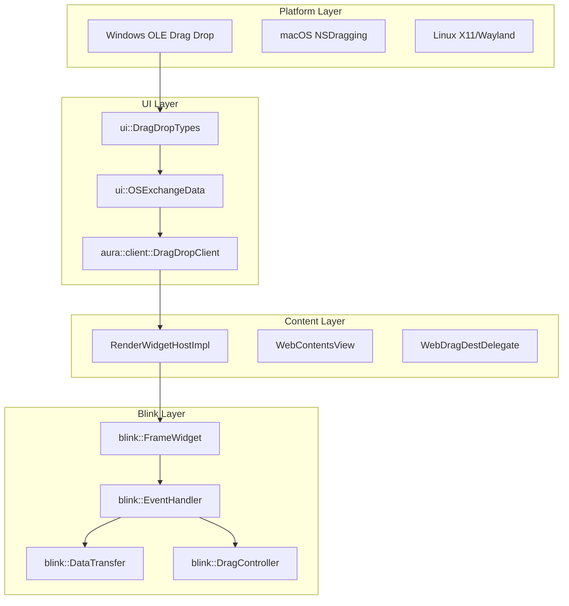
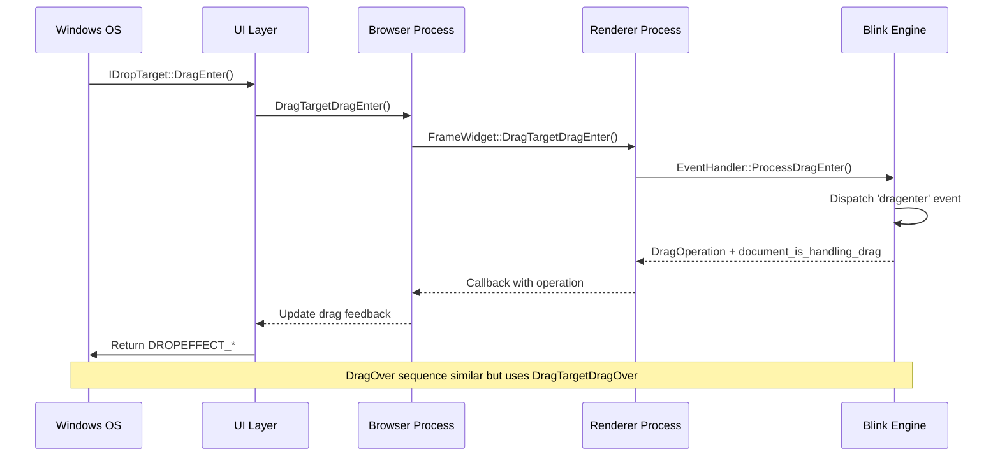
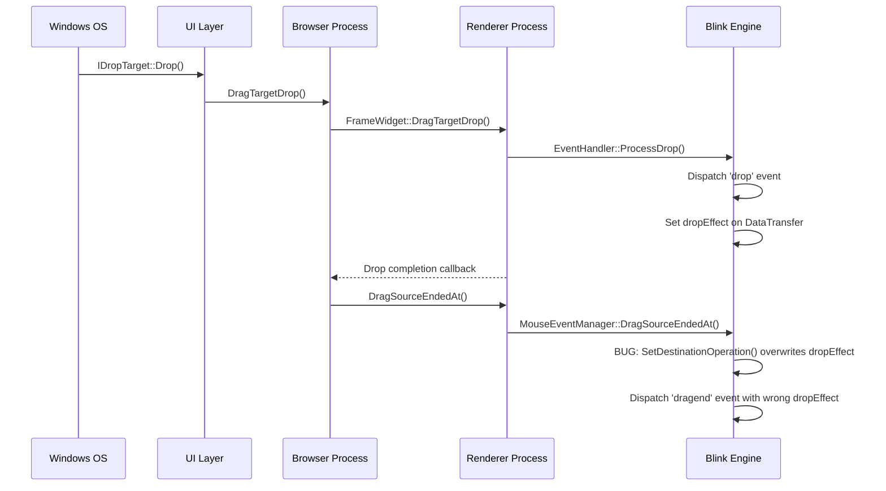

# Chromium Drag-and-Drop System Architecture

This document provides a comprehensive analysis of how drag-and-drop operations work in Chromium, with a focus on the Windows implementation and the interaction between browser and renderer processes.

## High-Level Architecture

Chromium's drag-and-drop system is built on a multi-layered architecture that spans from platform-specific APIs to web standards implementation:



## Core Components

### 1. Platform Abstraction Layer

#### [`ui/base/dragdrop/drag_drop_types.h`](/ui/base/dragdrop/drag_drop_types.h)
Defines cross-platform drag operation types and conversion utilities:

```cpp
enum DragOperation {
  DRAG_NONE = 0,
  DRAG_COPY = 1,     // Maps to DROPEFFECT_COPY on Windows
  DRAG_LINK = 2,     // Maps to DROPEFFECT_LINK on Windows  
  DRAG_MOVE = 16,    // Maps to DROPEFFECT_MOVE on Windows
};
```

#### [`ui/base/dragdrop/drag_drop_types_win.cc`](/ui/base/dragdrop/drag_drop_types_win.cc)
Windows-specific conversion between Chromium and OLE drag operations:

```cpp
uint32_t DragDropTypes::DragOperationToDropEffect(int drag_operation) {
  uint32_t drop_effect = DROPEFFECT_NONE;
  if (drag_operation & DRAG_LINK)  drop_effect |= DROPEFFECT_LINK;
  if (drag_operation & DRAG_COPY)  drop_effect |= DROPEFFECT_COPY;
  if (drag_operation & DRAG_MOVE)  drop_effect |= DROPEFFECT_MOVE;
  return drop_effect;
}
```

### 2. Mojom Interface Definitions

#### [`ui/base/dragdrop/mojom/drag_drop_types.mojom`](/ui/base/dragdrop/mojom/drag_drop_types.mojom)
Cross-process communication types:

```mojom
enum DragOperation {
  kNone = 0,
  kCopy = 1,
  kLink = 2,
  kMove = 16,
};

enum DragEventSource {
  kMouse,
  kTouch
};
```

#### [`third_party/blink/public/mojom/drag/drag.mojom`](/third_party/blink/public/mojom/drag/drag.mojom)
Blink-specific drag data structures:

```mojom
struct DragData {
  array<DragItem> items;
  string? file_system_id;
  bool force_default_action;
  network.mojom.ReferrerPolicy referrer_policy;
};

struct AllowedDragOperations {
  bool allow_copy;
  bool allow_link;
  bool allow_move;
};
```

#### [`third_party/blink/public/mojom/page/widget.mojom`](/third_party/blink/public/mojom/page/widget.mojom)
Browser-renderer communication interface:

```mojom
interface FrameWidget {
  DragTargetDragEnter(DragData drag_data,
                      gfx.mojom.PointF point_in_viewport,
                      gfx.mojom.PointF screen_point,
                      AllowedDragOperations operations_allowed,
                      uint32 key_modifiers)
      => (ui.mojom.DragOperation operation,
          bool document_is_handling_drag);
          
  DragTargetDragOver(gfx.mojom.PointF point_in_viewport,
                     gfx.mojom.PointF screen_point,
                     AllowedDragOperations operations_allowed,
                     uint32 key_modifiers)
      => (ui.mojom.DragOperation operation,
          bool document_is_handling_drag);

  DragTargetDragLeave(gfx.mojom.PointF point_in_viewport,
                      gfx.mojom.PointF screen_point);

  DragTargetDrop(DragData drag_data,
                 gfx.mojom.PointF point_in_viewport,
                 gfx.mojom.PointF screen_point,
                 uint32 key_modifiers) => ();

  DragSourceEndedAt(gfx.mojom.PointF point_in_viewport,
                    gfx.mojom.PointF screen_point,
                    ui.mojom.DragOperation drag_operation) => ();
};
```

### 3. Browser Process Components

#### [`content/browser/renderer_host/render_widget_host_impl.cc`](/content/browser/renderer_host/render_widget_host_impl.cc)
The primary browser-side coordinator for drag-drop operations:

```cpp
void RenderWidgetHostImpl::DragTargetDragEnter(
    const DropData& drop_data,
    const gfx::PointF& client_pt,
    const gfx::PointF& screen_pt,
    DragOperationsMask operations_allowed,
    int key_modifiers,
    DragOperationCallback callback) {
  // Convert to metadata and forward to Blink
  DragTargetDragEnterWithMetaData(DropDataToMetaData(drop_data), 
                                  client_pt, screen_pt, operations_allowed, 
                                  key_modifiers, std::move(callback));
}

void RenderWidgetHostImpl::DragSourceEndedAt(const gfx::PointF& client_point,
                                             const gfx::PointF& screen_point,
                                             ui::mojom::DragOperation operation,
                                             base::OnceClosure callback) {
  if (!blink_frame_widget_) return;
  
  // Notify renderer about drag source completion
  blink_frame_widget_->DragSourceEndedAt(
      ConvertWindowPointToViewport(client_point), screen_point, 
      operation, std::move(callback));
}
```

#### [`ash/drag_drop/drag_drop_controller.h`](/ash/drag_drop/drag_drop_controller.h)
ChromeOS-specific drag-drop coordination (also used in Windows):

```cpp
class DragDropController : public aura::client::DragDropClient,
                          public ui::EventHandler,
                          public gfx::AnimationDelegate {
public:
  ui::mojom::DragOperation StartDragAndDrop(
      std::unique_ptr<ui::OSExchangeData> data,
      aura::Window* root_window,
      aura::Window* source_window,
      const gfx::Point& screen_location,
      int allowed_operations,
      ui::mojom::DragEventSource source) override;
};
```

### 4. Renderer Process Components

#### [`third_party/blink/renderer/core/events/mouse_event_manager.cc`](/third_party/blink/renderer/core/input/mouse_event_manager.cc)
Where the dropEffect bug occurs - handles drag source completion:

```cpp
void MouseEventManager::DragSourceEndedAt(
    const WebMouseEvent& event,
    ui::mojom::DragOperation operation) {
  if (drag_state_.drag_src_) {
    // BUG: This overwrites the dropEffect value from DragTargetDragOver
    drag_state_.drag_src_->SetDestinationOperation(operation);
    
    DispatchDragEvent(event_type_names::kDragend, drag_state_.drag_src_,
                      event, drag_state_.drag_data_transfer_.Get());
  }
}
```

#### [`third_party/blink/renderer/core/clipboard/data_transfer.cc`](/third_party/blink/renderer/core/clipboard/data_transfer.cc)
The Web API DataTransfer implementation:

```cpp
void DataTransfer::SetDestinationOperation(ui::mojom::DragOperation operation) {
  // Called from MouseEventManager - overwrites dropEffect
  destination_operation_ = operation;
}

String DataTransfer::dropEffect() const {
  return ConvertEffectAllowedToDropEffect(destination_operation_);
}
```

## Process Communication Flow

### Drag Enter/Over Sequence



### Drag Drop Sequence



## Windows-Specific Implementation

### Platform Integration

The Windows implementation integrates with OLE drag-drop through these key conversion points:

1. **DROPEFFECT to DragOperation**: [`ui/base/dragdrop/drag_drop_types_win.cc`](/ui/base/dragdrop/drag_drop_types_win.cc)
2. **OSExchangeData**: Wraps Windows IDataObject interface via [`ui/base/dragdrop/os_exchange_data_provider_win.h`](/ui/base/dragdrop/os_exchange_data_provider_win.h)
3. **Desktop Drag Drop Client**: Handles window-level drag operations

### OSExchangeData Windows Implementation

The [`DataObjectImpl`](/ui/base/dragdrop/os_exchange_data_provider_win.h) class implements Windows' `IDataObject` interface:

```cpp
class DataObjectImpl : public DownloadFileObserver,
                       public IDataObject,
                       public IDataObjectAsyncCapability {
public:
  // IDataObject implementation for Windows OLE drag-drop
  HRESULT GetData(FORMATETC* format_etc, STGMEDIUM* medium) override;
  HRESULT GetDataHere(FORMATETC* format_etc, STGMEDIUM* medium) override;
  
  // Manages drag-drop state during OLE operations
  void set_in_drag_loop(bool in_drag_loop) { in_drag_loop_ = in_drag_loop; }
};
```

### Desktop Drag Drop Client

The [`DesktopDragDropClientWin`](/ui/views/widget/desktop_aura/desktop_drag_drop_client_win.h) handles Windows-specific drag operations:

```cpp
class DesktopDragDropClientWin : public aura::client::DragDropClient {
public:
  ui::mojom::DragOperation StartDragAndDrop(
      std::unique_ptr<ui::OSExchangeData> data,
      aura::Window* root_window,
      aura::Window* source_window,
      const gfx::Point& screen_location,
      int allowed_operations,
      ui::mojom::DragEventSource source) override;
};
```

This class bridges Chromium's cross-platform drag-drop interface with Windows OLE implementation.

### Key Windows Constants

```cpp
// From oleidl.h
#define DROPEFFECT_NONE   0
#define DROPEFFECT_COPY   1  
#define DROPEFFECT_MOVE   2
#define DROPEFFECT_LINK   4

// Chromium equivalents
DRAG_NONE = 0
DRAG_COPY = 1     // Direct match
DRAG_LINK = 2     // Different value!
DRAG_MOVE = 16    // Different value!
```

## Current Bug Analysis

### Root Cause: dropEffect Overwrite in MouseEventManager

The bug occurs in [`third_party/blink/renderer/core/events/mouse_event_manager.cc`](/third_party/blink/renderer/core/events/mouse_event_manager.cc) where `DragSourceEndedAt()` unconditionally calls `SetDestinationOperation()`, overwriting the dropEffect value that was properly set during the drop event processing.

### Bug Flow:

1. **During Drop**: `drop` event handler sets `event.dataTransfer.dropEffect = "copy"`
2. **After Drop**: `MouseEventManager::DragSourceEndedAt()` calls `SetDestinationOperation(operation)`
3. **Bug Result**: The `operation` parameter (from drag source) overwrites the dropEffect set by the drop target
4. **Wrong dragend**: The `dragend` event fires with incorrect dropEffect value

### Fix Implementation:

```cpp
// In MouseEventManager::DragSourceEndedAt()
void MouseEventManager::DragSourceEndedAt(
    const WebMouseEvent& event,
    ui::mojom::DragOperation operation) {
  if (drag_state_.drag_src_) {
    // FIXED: Only set destination operation if not already set by drop event
    if (!drag_state_.drag_src_->HasDropEffectBeenSet()) {
      drag_state_.drag_src_->SetDestinationOperation(operation);
    }
    
    DispatchDragEvent(event_type_names::kDragend, drag_state_.drag_src_,
                      event, drag_state_.drag_data_transfer_.Get());
  }
}
```

## Testing Framework

### Unit Tests
- [`content/browser/web_contents/web_contents_view_aura_unittest.cc`](/content/browser/web_contents/web_contents_view_aura_unittest.cc)
- [`ui/views/widget/drop_helper_unittest.cc`](/ui/views/widget/drop_helper_unittest.cc)

### Browser Tests
- [`content/browser/web_contents/web_contents_view_aura_browsertest.cc`](/content/browser/web_contents/web_contents_view_aura_browsertest.cc)
- [`chrome/browser/ui/views/drag_and_drop_interactive_uitest.cc`](/chrome/browser/ui/views/drag_and_drop_interactive_uitest.cc)

### Web Tests
Located in `third_party/blink/web_tests/external/wpt/html/editing/dnd/`:
- Basic drag-drop functionality
- DataTransfer API compliance
- Cross-frame drag operations

## Related Documentation

- [Chromium Design Doc: Aura Focus and Activation](https://www.chromium.org/developers/design-documents/aura/focus-and-activation)
- [W3C HTML5 Drag and Drop Specification](https://html.spec.whatwg.org/multipage/dnd.html)
- [Microsoft OLE Drag and Drop Documentation](https://docs.microsoft.com/en-us/windows/win32/shell/dragdrop)

## Terminology Reference

| Term/Symbol | Description | Code Reference/Example |
|-------------|-------------|------------------------|
| **Frame** | A document frame in Blink that can contain web content and handle events | [`blink::LocalFrame`](https://source.chromium.org/chromium/chromium/src/+/main:third_party/blink/renderer/core/frame/local_frame.h?q=symbol:%5Cbblink::LocalFrame%5Cb%20case:yes), [`content::RenderFrameHost`](https://source.chromium.org/chromium/chromium/src/+/main:content/public/browser/render_frame_host.h?q=symbol:%5Cbcontent::RenderFrameHost%5Cb%20case:yes) |
| **FrameWidget** | Blink interface that handles widget-level operations for a frame, including drag-drop coordination | [`blink::FrameWidget::DragTargetDragEnter()`](https://source.chromium.org/chromium/chromium/src/+/main:third_party/blink/public/mojom/page/widget.mojom?q=symbol:%5CbDragTargetDragEnter%5Cb%20case:yes) |
| **Widget** | UI component that can receive input events and manage rendering - fundamental building block | [`blink::WebFrameWidget`](https://source.chromium.org/chromium/chromium/src/+/main:third_party/blink/public/web/web_frame_widget.h?q=symbol:%5Cbblink::WebFrameWidget%5Cb%20case:yes), [`views::Widget`](https://source.chromium.org/chromium/chromium/src/+/main:ui/views/widget/widget.h?q=symbol:%5Cbviews::Widget%5Cb%20case:yes) |
| **RenderWidgetHost** | Browser-side proxy for communicating with renderer widgets via IPC | [`content::RenderWidgetHostImpl::DragTargetDrop()`](https://source.chromium.org/chromium/chromium/src/+/main:content/browser/renderer_host/render_widget_host_impl.h?q=symbol:%5Cbcontent::RenderWidgetHostImpl::DragTargetDrop%5Cb%20case:yes) |
| **DragTarget*** | Confusing naming convention: methods called ON a widget to notify it about drag events (not the drop destination) | `DragTargetDragEnter()` = "tell widget about drag enter" |
| **DragSource*** | Methods related to the widget that initiated a drag operation | `DragSourceEndedAt()` = "drag from this widget ended" |
| **OSExchangeData** | Cross-platform abstraction for drag data that wraps platform-specific clipboard/drag formats | [`ui::OSExchangeData`](https://source.chromium.org/chromium/chromium/src/+/main:ui/base/dragdrop/os_exchange_data.h?q=symbol:%5Cbui::OSExchangeData%5Cb%20case:yes) wraps [`IDataObject`](https://source.chromium.org/chromium/chromium/src/+/main:ui/base/dragdrop/os_exchange_data_provider_win.h?q=symbol:%5CbIDataObject%5Cb%20case:yes) on Windows |
| **DataObjectImpl** | Windows-specific implementation of IDataObject interface for OLE drag-drop | [`ui::DataObjectImpl : public IDataObject`](https://source.chromium.org/chromium/chromium/src/+/main:ui/base/dragdrop/os_exchange_data_provider_win.h?q=symbol:%5Cbui::DataObjectImpl%5Cb%20case:yes) |
| **DragOperation** | Cross-platform enum for drag operations (copy/move/link/none) | [`ui::mojom::DragOperation::kCopy`](https://source.chromium.org/chromium/chromium/src/+/main:ui/base/dragdrop/mojom/drag_drop_types.mojom?q=symbol:%5CbDragOperation%5Cb%20case:yes) |
| **DragOperationsMask** | Bitmask of allowed drag operations | [`int operations = DRAG_COPY \| DRAG_MOVE`](https://source.chromium.org/chromium/chromium/src/+/main:ui/base/dragdrop/drag_drop_types.h?q=symbol:%5CbDRAG_COPY%5Cb%20case:yes) |
| **DROPEFFECT_*** | Windows OLE drag-drop effect constants | [`DROPEFFECT_COPY`](https://source.chromium.org/chromium/chromium/src/+/main:ui/base/dragdrop/drag_drop_types_win.cc?q=symbol:%5CbDROPEFFECT_COPY%5Cb%20case:yes), `DROPEFFECT_MOVE`, `DROPEFFECT_LINK` |
| **DropData** | Browser-side representation of drag data being transferred | [`content::DropData`](https://source.chromium.org/chromium/chromium/src/+/main:content/public/common/drop_data.h?q=symbol:%5Cbcontent::DropData%5Cb%20case:yes) with URLs, text, files |
| **DragData** | Blink/renderer-side representation of drag data | [`blink::mojom::DragData`](https://source.chromium.org/chromium/chromium/src/+/main:third_party/blink/public/mojom/drag/drag.mojom?q=symbol:%5CbDragData%5Cb%20case:yes) |
| **DataTransfer** | Web API object exposed to JavaScript for drag-drop operations | [`event.dataTransfer.dropEffect = "copy"`](https://source.chromium.org/chromium/chromium/src/+/main:third_party/blink/renderer/core/clipboard/data_transfer.h?q=symbol:%5Cbblink::DataTransfer%5Cb%20case:yes) |
| **dropEffect** | Web API property indicating the type of drag operation performed | [`"none"`, `"copy"`, `"move"`, `"link"`](https://source.chromium.org/chromium/chromium/src/+/main:third_party/blink/renderer/core/clipboard/data_transfer.cc?q=symbol:%5Cbblink::DataTransfer::setDropEffect%5Cb%20case:yes) |
| **effectAllowed** | Web API property indicating which drag operations are allowed | [`"copy"`, `"move"`, `"copyMove"`, etc.](https://source.chromium.org/chromium/chromium/src/+/main:third_party/blink/renderer/core/clipboard/data_transfer.cc?q=symbol:%5Cbblink::DataTransfer::setEffectAllowed%5Cb%20case:yes) |
| **AllowedDragOperations** | Mojom struct specifying which operations are permitted | [`{allow_copy: true, allow_move: false}`](https://source.chromium.org/chromium/chromium/src/+/main:third_party/blink/public/mojom/drag/drag.mojom?q=symbol:%5CbAllowedDragOperations%5Cb%20case:yes) |
| **DragController** | Blink component that manages drag state and coordinates drag operations | [`blink::DragController`](https://source.chromium.org/chromium/chromium/src/+/main:third_party/blink/renderer/core/page/drag_controller.h?q=symbol:%5Cbblink::DragController%5Cb%20case:yes) |
| **MouseEventManager** | Blink component handling mouse events including drag operations (contains the dropEffect bug) | [`blink::MouseEventManager::DragSourceEndedAt()`](https://source.chromium.org/chromium/chromium/src/+/main:third_party/blink/renderer/core/input/mouse_event_manager.cc?q=symbol:%5Cbblink::MouseEventManager::DragSourceEndedAt%5Cb%20case:yes) |
| **EventHandler** | Blink component that processes input events and dispatches to appropriate handlers | [`blink::EventHandler::HandleDragEvent()`](https://source.chromium.org/chromium/chromium/src/+/main:third_party/blink/renderer/core/input/event_handler.cc?q=symbol:%5Cbblink::EventHandler::UpdateDragAndDrop%5Cb%20case:yes) |
| **WebContentsView** | Browser-side view component for web content that handles UI-level drag operations | [`content::WebContentsView::GetDropData()`](https://source.chromium.org/chromium/chromium/src/+/main:content/public/browser/web_contents_view.h?q=symbol:%5Cbcontent::WebContentsView::GetDropData%5Cb%20case:yes) |
| **WebDragDestDelegate** | Interface for handling drag operations not processed by web content | [`content::WebDragDestDelegate`](https://source.chromium.org/chromium/chromium/src/+/main:content/public/browser/web_drag_dest_delegate.h?q=symbol:%5Cbcontent::WebDragDestDelegate%5Cb%20case:yes) |
| **DragDropClient** | Aura interface for initiating and managing drag-drop operations at window level | [`aura::client::DragDropClient::StartDragAndDrop()`](https://source.chromium.org/chromium/chromium/src/+/main:ui/aura/client/drag_drop_client.h?q=symbol:%5Cbaura::client::DragDropClient::StartDragAndDrop%5Cb%20case:yes) |
| **DesktopDragDropClientWin** | Windows-specific implementation of DragDropClient | [`views::DesktopDragDropClientWin`](https://source.chromium.org/chromium/chromium/src/+/main:ui/views/widget/desktop_aura/desktop_drag_drop_client_win.h?q=symbol:%5Cbviews::DesktopDragDropClientWin%5Cb%20case:yes) |
| **DragDropController** | ChromeOS/Ash implementation of drag-drop coordination | [`ash::DragDropController`](https://source.chromium.org/chromium/chromium/src/+/main:ash/drag_drop/drag_drop_controller.h?q=symbol:%5Cbash::DragDropController%5Cb%20case:yes) |
| **IDataObject** | Windows COM interface for exchanging data during drag-drop | [`IDataObject::GetData()`](https://source.chromium.org/chromium/chromium/src/+/main:ui/base/dragdrop/os_exchange_data_provider_win.h?q=symbol:%5CbIDataObject::GetData%5Cb%20case:yes), [`IDataObject::SetData()`](https://source.chromium.org/chromium/chromium/src/+/main:ui/base/dragdrop/os_exchange_data_provider_win.h?q=symbol:%5CbIDataObject::SetData%5Cb%20case:yes) |
| **IDropTarget** | Windows COM interface implemented by drop targets | `IDropTarget::DragEnter()`, `IDropTarget::Drop()` |
| **IDropSource** | Windows COM interface implemented by drag sources | `IDropSource::QueryContinueDrag()` |
| **DragEventSource** | Enum indicating whether drag originated from mouse or touch | [`ui::mojom::DragEventSource::kMouse`](https://source.chromium.org/chromium/chromium/src/+/main:ui/base/dragdrop/mojom/drag_drop_types.mojom?q=symbol:%5CbDragEventSource%5Cb%20case:yes) |
| **DragItem** | Union type representing different kinds of draggable data | [`DragItemString`](https://source.chromium.org/chromium/chromium/src/+/main:third_party/blink/public/mojom/drag/drag.mojom;l=15), `DragItemBinary`, `DragItemFileSystemFile` |
| **Viewport Coordinates** | Coordinate system relative to the rendered viewport | [`ConvertWindowPointToViewport(client_point)`](https://source.chromium.org/chromium/chromium/src/+/main:content/browser/renderer_host/render_widget_host_impl.cc?q=symbol:%5CbConvertWindowPointToViewport%5Cb%20case:yes) |
| **Screen Coordinates** | Absolute screen coordinates | [`gfx::PointF screen_point`](https://source.chromium.org/chromium/chromium/src/+/main:ui/gfx/geometry/point_f.h?q=symbol:%5Cbgfx::PointF%5Cb%20case:yes) |
| **Client Coordinates** | Coordinates relative to the client window | [`gfx::PointF client_point`](https://source.chromium.org/chromium/chromium/src/+/main:ui/gfx/geometry/point_f.h?q=symbol:%5Cbgfx::PointF%5Cb%20case:yes) |
| **Mojom** | Chromium's IDL for cross-process communication interfaces | [`.mojom` files](https://source.chromium.org/chromium/chromium/src/+/main:mojo/public/mojom/) define IPC contracts |
| **blink_frame_widget_** | Browser-side proxy to renderer's FrameWidget | [`blink_frame_widget_->DragTargetDrop()`](https://source.chromium.org/chromium/chromium/src/+/main:content/browser/renderer_host/render_widget_host_impl.cc?q=symbol:%5CbDragTargetDrop%5Cb%20case:yes) |
| **drag_state_** | Renderer-side state tracking current drag operation | [`drag_state_.drag_src_`](https://source.chromium.org/chromium/chromium/src/+/main:third_party/blink/renderer/core/input/mouse_event_manager.h?q=symbol:%5Cbdrag_state_%5Cb%20case:yes), [`drag_state_.drag_data_transfer_`](https://source.chromium.org/chromium/chromium/src/+/main:third_party/blink/renderer/core/input/mouse_event_manager.h?q=symbol:%5Cbdrag_state_%5Cb%20case:yes) |
| **destination_operation_** | Internal field storing the current drag operation result | [`destination_operation_ = operation`](https://source.chromium.org/chromium/chromium/src/+/main:third_party/blink/renderer/core/clipboard/data_transfer.cc?q=symbol:%5Cbdestination_operation_%5Cb%20case:yes) |
| **SetDestinationOperation()** | Method that overwrites dropEffect (source of the bug) | [`drag_src_->SetDestinationOperation(operation)`](https://source.chromium.org/chromium/chromium/src/+/main:third_party/blink/renderer/core/clipboard/data_transfer.cc?q=symbol:%5CbSetDestinationOperation%5Cb%20case:yes) |
| **FORMATETC** | Windows structure describing a data format | [`{cfFormat: CF_TEXT, tymed: TYMED_HGLOBAL}`](https://source.chromium.org/chromium/chromium/src/+/main:ui/base/dragdrop/os_exchange_data_provider_win.cc?q=symbol:%5CbFORMATETC%5Cb%20case:yes) |
| **STGMEDIUM** | Windows structure containing data in specified format | Storage medium for drag data |
| **CF_*** | Windows clipboard format constants | [`CF_TEXT`](https://source.chromium.org/chromium/chromium/src/+/main:ui/base/dragdrop/os_exchange_data_provider_win.cc;l=50), `CF_UNICODETEXT`, `CF_HDROP` |
| **Aura** | Chromium's cross-platform windowing system | [`aura::Window`](https://source.chromium.org/chromium/chromium/src/+/main:ui/aura/window.h?q=symbol:%5Cbaura::Window%5Cb%20case:yes), [`aura::client::*` interfaces](https://source.chromium.org/chromium/chromium/src/+/main:ui/aura/client/?q=symbol:%5Cbaura::client%5Cb%20case:yes) |
| **Views** | Chromium's cross-platform UI toolkit | [`views::Widget`](https://source.chromium.org/chromium/chromium/src/+/main:ui/views/widget/widget.h), [`views::View`](https://source.chromium.org/chromium/chromium/src/+/main:ui/views/view.h) |
| **Blink** | Chromium's web rendering engine | All [`third_party/blink/` components](https://source.chromium.org/chromium/chromium/src/+/main:third_party/blink/) |
| **Content** | Chromium's multi-process content layer | [`content::RenderWidgetHost`](https://source.chromium.org/chromium/chromium/src/+/main:content/public/browser/render_widget_host.h), [`content::WebContents`](https://source.chromium.org/chromium/chromium/src/+/main:content/public/browser/web_contents.h) |
| **UI Base** | Low-level UI utilities and abstractions | [`ui::DragDropTypes`](https://source.chromium.org/chromium/chromium/src/+/main:ui/base/dragdrop/drag_drop_types.h), [`ui::OSExchangeData`](https://source.chromium.org/chromium/chromium/src/+/main:ui/base/dragdrop/os_exchange_data.h) |
| **Mojo** | Chromium's IPC system | [`mojo/public/mojom/` interface definitions](https://source.chromium.org/chromium/chromium/src/+/main:mojo/public/mojom/) |
| **gfx::PointF** | Chromium's floating-point 2D coordinate | [`gfx::PointF{x: 100.5, y: 200.0}`](https://source.chromium.org/chromium/chromium/src/+/main:ui/gfx/geometry/point_f.h) |
| **perfetto::TracedValue** | Chromium's tracing framework value type | [Used for debugging/profiling](https://source.chromium.org/chromium/chromium/src/+/main:base/trace_event/traced_value.h) |
| **WebInputEvent** | Base class for all web input events | [`blink::WebMouseEvent`](https://source.chromium.org/chromium/chromium/src/+/main:third_party/blink/public/common/input/web_mouse_event.h), [`blink::WebKeyboardEvent`](https://source.chromium.org/chromium/chromium/src/+/main:third_party/blink/public/common/input/web_keyboard_event.h) |
| **DragOperationCallback** | Callback type for async drag operation results | [`base::OnceCallback<void(DragOperation, bool)>`](https://source.chromium.org/chromium/chromium/src/+/main:content/browser/renderer_host/render_widget_host_impl.h;l=200) |
| **key_modifiers** | Bitmask of keyboard modifier keys during drag | [`WebInputEvent::kShiftKey \| WebInputEvent::kControlKey`](https://source.chromium.org/chromium/chromium/src/+/main:third_party/blink/public/common/input/web_input_event.h;l=50) |
| **document_is_handling_drag** | Boolean indicating if web page is processing the drag | [Returned from renderer to indicate custom handling](https://source.chromium.org/chromium/chromium/src/+/main:third_party/blink/renderer/core/input/event_handler.cc;l=1400) |
| **force_default_action** | Flag forcing browser default action instead of web page handling | [Used when page doesn't handle drop event](https://source.chromium.org/chromium/chromium/src/+/main:third_party/blink/public/mojom/drag/drag.mojom;l=40) |

This architecture demonstrates Chromium's sophisticated approach to cross-platform drag-drop implementation while maintaining compliance with web standards and platform conventions.
