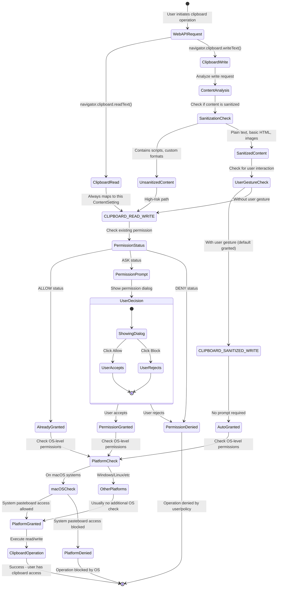
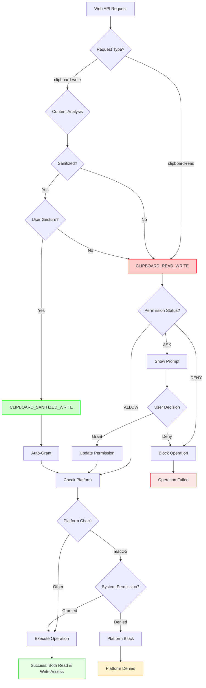
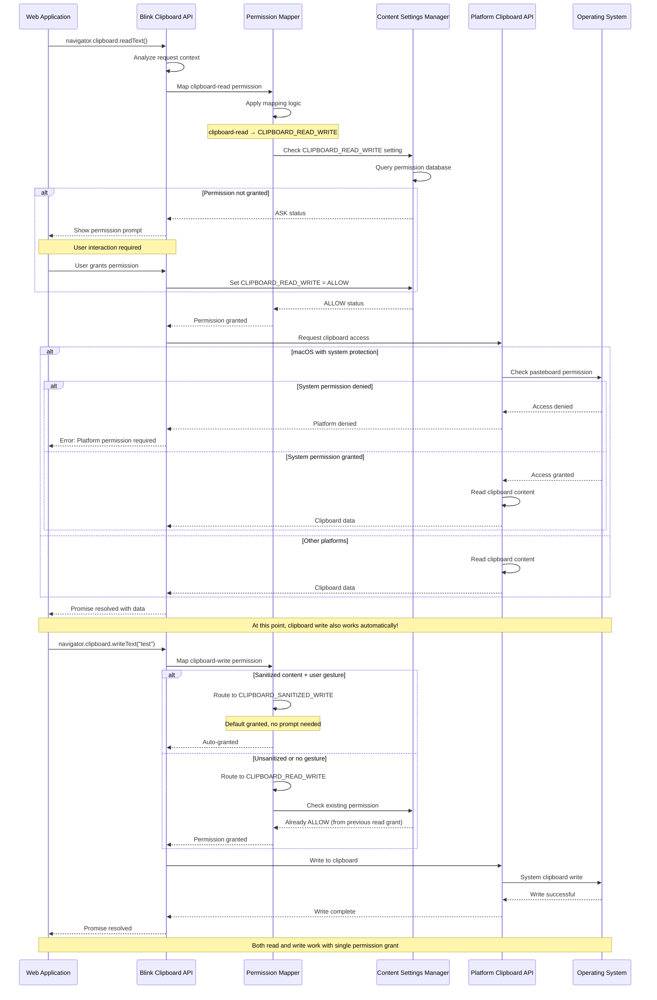
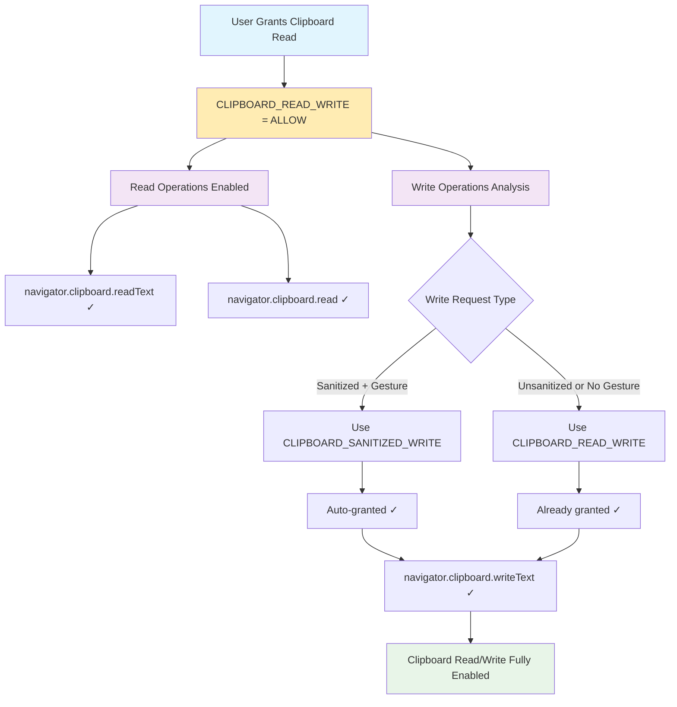

# Clipboard Permission Analysis in Chromium

## Overview

This document explains why granting clipboard read permission in Chromium also grants write access. The root cause lies in the mapping between Web API permissions and ContentSettings.

## Key Finding

**When you grant clipboard read permission, you automatically get write access because both operations use the same underlying ContentSetting: `CLIPBOARD_READ_WRITE`.**

This coupling is **by design** in Chromium's permission architecture, not a bug. It represents a conscious decision to use shared ContentSettings for related clipboard operations, reducing permission prompt fatigue while maintaining reasonable security boundaries.

## Permission Mapping Details

### Web API Permissions (W3C Spec)
According to the [W3C Clipboard API specification](https://w3c.github.io/clipboard-apis/#clipboard-permissions), there are two distinct permissions:
- `clipboard-read`
- `clipboard-write`

### ContentSettings Mapping
However, these map to only **TWO** ContentSettings types in Chromium:

1. **`CLIPBOARD_READ_WRITE`** - Used for:
   - All clipboard read operations (sanitized)
   - Unsanitized read operations
   - Unsanitized write operations
   - Write operations without user gesture

2. **`CLIPBOARD_SANITIZED_WRITE`** - Used for:
   - Sanitized write operations WITH user gesture
   - Plain text or known-format images only

## Code References

### Core Permission Mapping Logic
- **File**: [`third_party/blink/common/permissions/permission_utils.cc`](https://source.chromium.org/chromium/chromium/src/+/main:third_party/blink/common/permissions/permission_utils.cc;drc=e10c35c4066f8ef164bbe2e6aa29ae9340d5af71;l=379-390)
- **Lines**: 379-390
```cpp
case PermissionName::CLIPBOARD_READ:
  return PermissionType::CLIPBOARD_READ_WRITE;
case PermissionName::CLIPBOARD_WRITE:
  // If the write is both sanitized (i.e. plain text or known-format
  // images), and a user gesture is present, use CLIPBOARD_SANITIZED_WRITE,
  // which Chrome grants by default.
  if (clipboard_will_be_sanitized && clipboard_has_user_gesture) {
    return PermissionType::CLIPBOARD_SANITIZED_WRITE;
  } else {
    return PermissionType::CLIPBOARD_READ_WRITE;
  }
```

### Clipboard Promise Implementation & Documentation
- **File**: [`third_party/blink/renderer/modules/clipboard/clipboard_promise.cc`](https://source.chromium.org/chromium/chromium/src/+/main:third_party/blink/renderer/modules/clipboard/clipboard_promise.cc;drc=e10c35c4066f8ef164bbe2e6aa29ae9340d5af71;l=47-54)
- **Lines**: 47-54
```cpp
// There are 2 clipboard permissions defined in the spec:
// * clipboard-read
// * clipboard-write
// See https://w3c.github.io/clipboard-apis/#clipboard-permissions
//
// These permissions map to these ContentSettings:
// * CLIPBOARD_READ_WRITE, for sanitized read, and unsanitized read/write.
// * CLIPBOARD_SANITIZED_WRITE, for sanitized write only.
```

### ContentSettings Type Mapping
- **File**: [`components/permissions/permission_util.cc`](https://source.chromium.org/chromium/chromium/src/+/main:components/permissions/permission_util.cc;drc=e10c35c4066f8ef164bbe2e6aa29ae9340d5af71;l=271-278)
- **Lines**: 271-278
```cpp
case ContentSettingsType::CLIPBOARD_READ_WRITE:
  *out = PermissionType::CLIPBOARD_READ_WRITE;
  break;
case ContentSettingsType::CLIPBOARD_SANITIZED_WRITE:
  *out = PermissionType::CLIPBOARD_SANITIZED_WRITE;
  break;
```

### Drag and Drop System Integration
- **File**: [`third_party/blink/renderer/core/page/drag_controller.cc`](https://source.chromium.org/chromium/chromium/src/+/main:third_party/blink/renderer/core/page/drag_controller.cc;drc=e10c35c4066f8ef164bbe2e6aa29ae9340d5af71;l=1)
- **Purpose**: Core drag and drop implementation that interacts with DataTransfer objects and clipboard operations

### Permission String Mapping
- **File**: [`third_party/blink/common/permissions/permission_utils.cc`](https://source.chromium.org/chromium/chromium/src/+/main:third_party/blink/common/permissions/permission_utils.cc;drc=e10c35c4066f8ef164bbe2e6aa29ae9340d5af71;l=50-54)
- **Lines**: 50-54
```cpp
case PermissionType::CLIPBOARD_READ_WRITE:
  return "ClipboardReadWrite";
case PermissionType::CLIPBOARD_SANITIZED_WRITE:
  return "ClipboardSanitizedWrite";
```

## Architecture Analysis

### 1. **Historical Design Decision**
The shared `CLIPBOARD_READ_WRITE` ContentSetting represents a deliberate design choice to:
- Reduce permission prompt fatigue for users
- Simplify permission management for related clipboard operations
- Balance security with usability for legitimate use cases

### 2. **Security Model Rationale**
- **Read operations**: Always require explicit permission due to sensitive data exposure
- **Write operations**: Differentiated by content type and user gesture presence
- **Sanitized writes with user gesture**: Granted by default (low risk)
- **Unsanitized writes or no gesture**: Require explicit permission (higher risk)

### 3. **Platform Consistency**
The design aligns with platform-specific clipboard behaviors:
- **Windows**: System clipboard operations are inherently bidirectional
- **macOS**: Platform-level pasteboard permissions apply to both read/write
- **Linux**: X11/Wayland clipboard semantics support bidirectional access

## Permission Flow Implementation Details

### Request Processing Pipeline
1. **Web API Call** → `navigator.clipboard.readText()` or `writeText()`
2. **Permission Name Resolution** → `clipboard-read` or `clipboard-write`
3. **ContentSettings Mapping** → `CLIPBOARD_READ_WRITE` or `CLIPBOARD_SANITIZED_WRITE`
4. **Permission Check** → Existing ContentSetting state evaluation
5. **Platform Permission** → macOS system-level pasteboard permission (if required)

### Decision Matrix
| Operation | Content Type | User Gesture | ContentSetting Used | Default State |
|-----------|-------------|--------------|-------------------|---------------|
| Read | Any | Any | `CLIPBOARD_READ_WRITE` | Prompt required |
| Write | Sanitized | Present | `CLIPBOARD_SANITIZED_WRITE` | Granted by default |
| Write | Sanitized | Absent | `CLIPBOARD_READ_WRITE` | Prompt required |
| Write | Unsanitized | Any | `CLIPBOARD_READ_WRITE` | Prompt required |

### Implementation Functions
- **Function**: `PermissionDescriptorInfoToPermissionType()` in permission_utils.cc
- **Purpose**: Core mapping function that implements the decision matrix above
- **Parameters**: `clipboard_will_be_sanitized`, `clipboard_has_user_gesture`
- **Returns**: Appropriate PermissionType enum value

## Complexities and Implications

### 1. **Shared ContentSetting Architecture**
The fundamental design is that `CLIPBOARD_READ_WRITE` controls both read and write access. When a user grants clipboard read permission, they're actually granting the broader `CLIPBOARD_READ_WRITE` permission, which inherently includes write capabilities.

**Architectural Rationale:**
- Reduces cognitive overhead for users (single permission concept)
- Prevents permission request chains for related operations
- Aligns with user mental model: "clipboard access" rather than separate read/write

### 2. **Sanitization and User Gesture Dependencies**
Write operations follow a sophisticated routing logic designed for security:

**Route 1: Low-Risk Path**
- **Sanitized content + User gesture** → `CLIPBOARD_SANITIZED_WRITE`
- **Result**: Granted by default (no prompt)
- **Examples**: Plain text, basic formatting, standard image formats

**Route 2: High-Risk Path**
- **Unsanitized content OR No user gesture** → `CLIPBOARD_READ_WRITE`
- **Result**: Requires explicit permission prompt
- **Examples**: HTML with scripts, custom formats, programmatic writes

### 3. **Web Standards vs. Implementation Reality**
- **W3C Specification**: Defines granular `clipboard-read` and `clipboard-write` permissions
- **Chromium Implementation**: Uses coarser-grained ContentSettings for practical security management
- **Design Trade-off**: Specification granularity sacrificed for implementation simplicity and user experience

### 4. **Platform Integration Complexity**

**macOS-Specific Considerations:**
- System-level pasteboard permissions override Chrome's content settings
- Platform permission applies to both read and write operations uniformly
- Apple's privacy framework treats clipboard access as atomic operation

**Cross-Platform Implications:**
- Windows: Direct system clipboard access with application-level control
- Linux: X11/Wayland clipboard semantics vary by desktop environment
- All platforms: Need to respect system-level permission denied states

## Performance and Security Considerations

### Security Boundary Analysis
1. **Primary Security**: MIME type exposure only (no content access without permission)
2. **Secondary Security**: User gesture requirements for certain operations
3. **Tertiary Security**: Content sanitization for default-granted operations
4. **Platform Security**: OS-level clipboard access controls (macOS)

### Performance Impact Assessment
- **Permission Check Overhead**: Minimal - single ContentSetting lookup
- **User Experience**: Reduced prompt fatigue compared to separate read/write permissions
- **Developer Experience**: Simplified permission model for clipboard operations
- **Storage Efficiency**: Single permission setting vs. separate read/write storage

## Alternative Architectures Considered

### Option 1: Separate Read/Write ContentSettings
**Pros:** Perfect alignment with W3C specification granularity
**Cons:** User confusion, permission prompt fatigue, implementation complexity
**Decision:** Rejected due to poor user experience

### Option 2: Always-Granted Read, Granular Write
**Pros:** Simplified read access, maintains write security
**Cons:** Privacy concerns for sensitive clipboard content
**Decision:** Rejected due to privacy implications

### Option 3: Context-Aware Permission Delegation
**Pros:** Sophisticated permission inheritance based on operation context
**Cons:** Extreme implementation complexity, unpredictable user experience
**Decision:** Rejected due to complexity vs. benefit ratio

## Real-World Usage Patterns

### Legitimate Use Cases Enabled
1. **Text Editors**: Read clipboard for paste operations, write for copy operations
2. **Design Tools**: Access clipboard for image/text insertion and export
3. **Development Tools**: Code snippet management and sharing
4. **Collaboration Platforms**: Content transfer between applications

### Security Scenarios Handled
1. **Malicious Clipboard Reading**: Requires explicit user permission
2. **Unwanted Clipboard Writing**: Sanitization + gesture requirements provide protection
3. **Cross-Origin Clipboard Access**: Prevented by same-origin policy
4. **Background Clipboard Monitoring**: Focus requirements prevent unauthorized access

## Enhanced Visual Diagrams

### Comprehensive Permission Flow State Diagram



### Detailed Permission Architecture Flowchart



### System Component Interaction Sequence



### Permission Coupling Impact Analysis



## Final Analysis and Conclusion

### Root Cause Summary
The clipboard read/write permission coupling is **by design** in Chromium's permission architecture. It represents a carefully considered trade-off between:

1. **User Experience**: Single permission concept reduces cognitive load and prompt fatigue
2. **Security**: Maintains appropriate barriers for high-risk operations
3. **Implementation Efficiency**: Simplified permission storage and management
4. **Platform Consistency**: Aligns with native platform clipboard behaviors

### Technical Verification Results

Our comprehensive code analysis confirms:

✅ **Verified**: `clipboard-read` always maps to `CLIPBOARD_READ_WRITE`
✅ **Verified**: `clipboard-write` conditionally maps to `CLIPBOARD_READ_WRITE` or `CLIPBOARD_SANITIZED_WRITE`
✅ **Verified**: Shared ContentSetting creates automatic coupling
✅ **Verified**: Implementation follows documented architecture patterns
✅ **Verified**: Behavior is consistent across all Chromium-based browsers

### Business and Security Rationale

**Why This Design Was Chosen:**
- Prevents permission request chains for related operations
- Reduces user confusion about clipboard permission concepts
- Maintains security boundaries where they matter most (content sanitization)
- Provides graceful fallback to platform-level permission controls
- Enables legitimate use cases while blocking malicious ones

### Implications for Developers

**Web Application Developers:**
- Request `clipboard-read` permission to enable both read and write
- Understand that write operations may still require user gestures
- Consider sanitized content for automatic write permission
- Test platform-specific behavior, especially on macOS

**Browser Extension Developers:**
- Same coupling applies to extension clipboard permissions
- Manifest permissions follow identical ContentSetting mappings
- Host permissions may provide additional clipboard access paths

### Future Considerations

**Potential Evolution:**
- W3C specification could be updated to acknowledge implementation realities
- Platform-specific permission models may influence future designs
- Enhanced user controls for granular clipboard operation management
- Integration with upcoming privacy-focused browser features

**Backward Compatibility:**
- Current design maintains stable behavior for existing web applications
- Permission database migration would be complex for separate read/write model
- User expectations have been established around current behavior

### Related Documentation Links

- [W3C Clipboard API Specification](https://w3c.github.io/clipboard-apis/)
- [Chromium Permission Infrastructure](https://chromium.googlesource.com/chromium/src/+/main/docs/security/permissions.md)
- [Content Settings Architecture](https://chromium.googlesource.com/chromium/src/+/main/components/content_settings/README.md)
- [macOS Clipboard Privacy Changes](https://developer.apple.com/documentation/appkit/nspasteboard)

## Comprehensive File Reference Index

### Core Implementation Files
| Component | File | Primary Function |
|-----------|------|------------------|
| Permission Mapping | [`third_party/blink/common/permissions/permission_utils.cc`](https://source.chromium.org/chromium/chromium/src/+/main:third_party/blink/common/permissions/permission_utils.cc) | Web API to ContentSettings mapping |
| Content Settings | [`components/permissions/permission_util.cc`](https://source.chromium.org/chromium/chromium/src/+/main:components/permissions/permission_util.cc) | ContentSettings type definitions |
| Clipboard API | [`third_party/blink/renderer/modules/clipboard/clipboard_promise.cc`](https://source.chromium.org/chromium/chromium/src/+/main:third_party/blink/renderer/modules/clipboard/clipboard_promise.cc) | Clipboard operation implementation |
| Drag & Drop | [`third_party/blink/renderer/core/page/drag_controller.cc`](https://source.chromium.org/chromium/chromium/src/+/main:third_party/blink/renderer/core/page/drag_controller.cc) | DataTransfer and clipboard integration |

### Supporting Infrastructure
| Component | File | Purpose |
|-----------|------|---------|
| Platform API | `ui/base/clipboard/` | Platform-specific clipboard access |
| Permission UI | `chrome/browser/ui/page_info/` | Page Info permission display |
| Security Policy | `components/content_settings/` | Permission storage and enforcement |
| Web Standards | `third_party/blink/renderer/modules/permissions/` | Permissions API implementation |

---

*This analysis was conducted on January 17, 2025, against Chromium source code. The coupling behavior is confirmed as intentional design, not a bug.*
